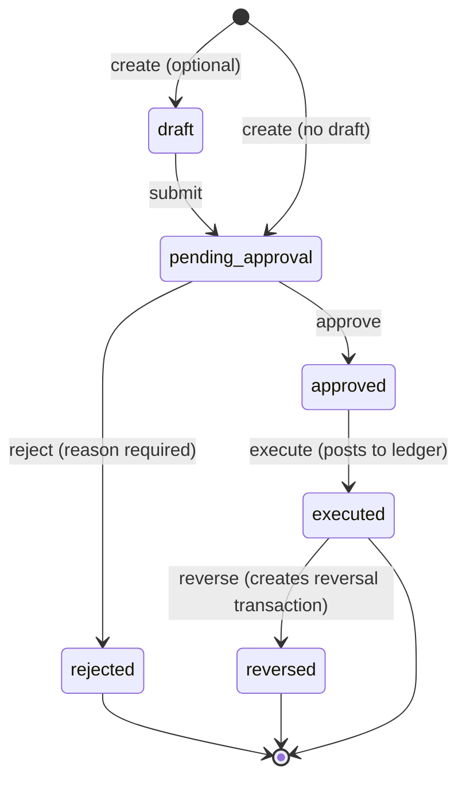

# ADR-0005: Financial approval & reversal model (cross-cutting principle)

**Status:** Accepted (principle) · Implementation deferred (Planning Only)
**Date:** 2026-07-07
**Track:** F1 — Financial Approval Foundation (cross-cutting foundation track, not a feature module).
**Applies to:** every balance-affecting operation, from M4 onward (Treasury, Orders/POS,
Payments, Expenses, Reports).

## Context

In the previous project, financial operations were treated as final the moment they were performed,
and corrections were made by **deleting or editing** existing records. This caused balance drift,
untraceable changes, and disputes with no audit trail. It was one of the largest sources of pain.

The product owner requires that this concept be designed into the system **from the start**, so that
future financial modules are built on it rather than having approval/reversal bolted on later.

## Decision

Adopt a **Financial Approval & Reversal Model** as a cross-cutting architectural principle. Any
operation that affects a financial balance is **not final on execution**; it moves through an
explicit lifecycle and is never mutated or deleted after the fact.

### Lifecycle

- Some operations may skip `draft` and start at `pending_approval`.
- `executed` posts the movement(s) to the append-only ledger.
- `reversed` **never deletes** the original; it creates a linked **reversal transaction**.

### Operations in scope

Bill collection (payment), payment void/reversal, expense record, expense void, treasury
withdrawal, treasury deposit, treasury transfer, and any other balance-affecting adjustment.

### Hard rules

1. No financial record is ever hard-deleted.
2. No financial record is edited after execution.
3. Every undo is a **new reversal transaction** linked to the original (`reverses_id`).
4. Every state transition is written to `audit_log`.
5. The record must always answer: **who created**, **who approved**, **who rejected**, **timestamp
   of each step**, and the **reason** for rejection/reversal.
6. Balances remain **computed from the ledger** (`SUM(movements)`) — never a stored balance column
   (consistent with ADR/DB principle: no summary tables).

### Approval requirement configuration

Whether a given operation requires approval (and the minimum approver role / threshold) is
**configurable per restaurant** (e.g. amount thresholds, role gates). Auto-approval for low-risk
operations is allowed but still records an explicit `approved_by = creator` with an
`auto_approved` flag, so the audit chain is never empty.

## Consequences

- Future module designs (M4 Treasury, M5/M6 POS & Payments, M10 Expenses, M12 Reports) must model
  financial actions as lifecycle-tracked records with reversal-by-new-transaction, not edit/delete.
- Data model gains (when implemented): approval/lifecycle fields (`status`, `created_by`,
  `approved_by`, `rejected_by`, `approved_at`, `rejected_at`, `executed_at`, `reversed_at`,
  `rejection_reason`, `reversal_reason`, `reverses_id`) and an `audit_log` action set for financial
  approval events.
- Slightly more records and steps per financial action — accepted as the cost of a correct,
  auditable ledger.
- Reports naturally reflect reversals (original + reversal both visible) instead of silent edits.

## Scope note (Planning Only)

This ADR fixes the **principle and contract**. No tables, RPCs, or UI are implemented now. The F1
foundation track (see `modules.md`) and each affected module's plan will specify concrete schema,
RPC signatures, and screens at their gates. Open items to resolve at that time: exact approval
threshold model, per-operation approval matrix, and whether a shared `approval_requests` table vs
per-domain lifecycle columns is used.
