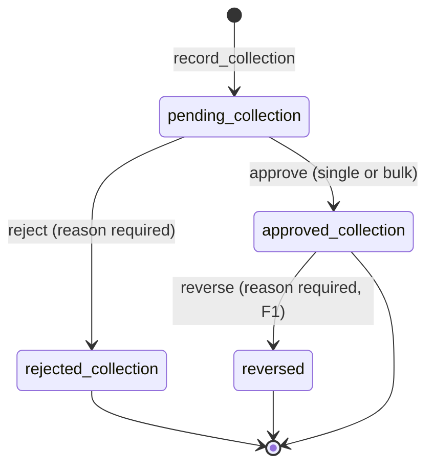
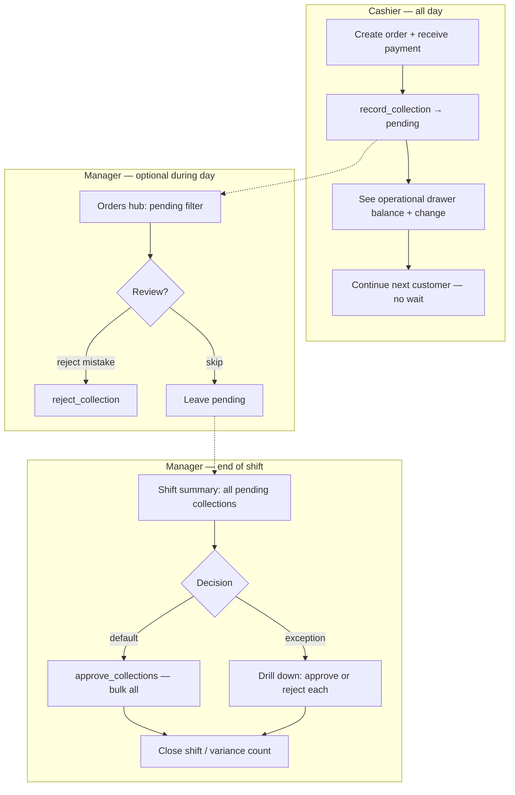
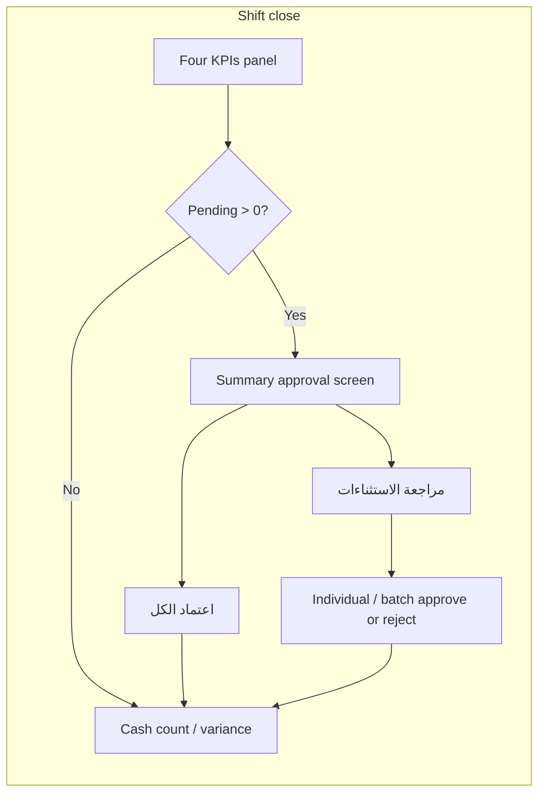

# ADR-0025: Revenue collection approval (F1 for POS payments)

**Status:** **Superseded for operational money path (2026-07-19)** — collections execute on
record; manager **Reject** = reverse with full audit. Pending→approve gate removed from product UX.
Historical decision text below retained for archaeology.
**Date:** 2026-07-08
**Supersedes (partial):** M5A behaviour where `finalize_sale` posts ledger movements immediately on
"pay" — M5B introduced an explicit collection approval gate (later removed 2026-07-19).

### Amendment 2026-07-19 — execute now / reject = reverse

Product policy: every cash-drawer / treasury-affecting collection posts ledger **immediately** on
`finalize_sale` / `record_collection` (via auto-post trigger → `m5b_post_collection_ledger`).
There is **no Approve wait**. Managers review the audit log; erroneous rows are **Rejected**, which
delegates to `reverse_collection` (append-only reversal movement; original row kept as `reversed`).
Operational drawer balance = shift ledger movements only (no pending-cash add-on).
**Complements:** [ADR-0005](./0005-financial-approval-and-reversal-model.md) (F1),
[ADR-0021](./0021-pos-thin-client-financial-core.md) (POS thin client),
[ADR-0024](./0024-order-lifecycle-three-dimensions.md) (order vs payment dimensions),
[ADR-0026](./0026-pending-order-edit-and-review.md) (pending edit + review — M5C),
[ADR-0028](./0028-pending-expense-approval-lifecycle.md) (pending expense lifecycle — same F1 gate),
[ADR-0013](./0013-multi-treasury-foundation.md) (multi-treasury ledger).

## Context

M5A `finalize_sale` records payments and posts `treasury_movements` in one atomic step when the
cashier presses "pay". In live operation, mistakes happen: wrong button, customer changes mind,
payment method error, or revenue recorded before cash/digital receipt is confirmed.

The product owner requires the **same F1 philosophy** used for M4 expenses and transfers:
collections are **not final on record**; they pass through approval before the ledger and treasury
reports treat them as real income. Order progress (kitchen, delivery) must remain independent.

**2026-07-09 amendment:** Customer-facing "how much has been taken for this order" must **not** be
confused with internal "has the manager approved this into the ledger". Delivery and partial pay
require creating orders **without** any collection, then collecting later — full or in installments.
Edits while pending must **not** recreate the whole collection; they collect **remaining only**.

## Decision

> **Order ≠ Collection.** Recording a collection does **not** post to the ledger.
> **Approved collection** posts ledger movements. **Rejected** collections never touch the ledger.
> **Reversal** after approval creates new linked movements — never UPDATE/DELETE.
>
> **Customer payment ≠ Internal approval.** An order can be **Paid** (customer settled) and still
> **Pending Approval** (ledger not yet posted).

### 1. Separation of concerns

| Concept | Responsibility |
| ------- | -------------- |
| **Order** | Items, totals, customer, fulfillment, print intent |
| **Collection** | Money the cashier *claims* was taken (tenders per payment method) — one or more rows |
| **Approval** | Manager confirms collection → ledger + treasury (per collection row) |
| **Customer payment position** | How much of the order total is covered by active collections (pending + approved) |

### 1.1 Two independent axes (locked 2026-07-09)

| Axis | Values | Based on |
| ---- | ------ | -------- |
| **Customer payment** (`payment_status`) | `unpaid` · `partial` · `paid` | **Collected Amount** vs **Order Total** |
| **Internal approval** (per `order_payments.collection_status`) | `pending` · `approved` · `rejected` · `reversed` | F1 lifecycle — **ledger only on approved** |

Valid combinations (examples):

| payment_status | Approval reality | Meaning |
| -------------- | ---------------- | ------- |
| `unpaid` | no collections | Order created, pay later |
| `paid` | all covering rows `pending` | Cashier took full amount; manager not yet approved |
| `partial` | some `pending` and/or `approved` | Customer still owes Remaining |
| `paid` | all covering rows `approved` | Settled + in ledger |
| `paid` | mix pending + approved | Settled; some rows still awaiting approve |

**No conflict** between axes — UI shows both.

### 1.2 Four operational amounts (always visible)

Every order card / detail / hub row exposes:

| Field | Definition |
| ----- | ---------- |
| **Order Total** | Authoritative `orders.total` |
| **Collected Amount** | `SUM(net_amount)` of collections with status ∈ {`pending`, `approved`} |
| **Remaining Amount** | `max(0, Order Total − Collected Amount)` |
| **Payment Status** | `unpaid` if Collected = 0; `paid` if Collected ≥ Total; else `partial` |

Rejected and reversed rows **do not** count toward Collected.

**Official revenue / ledger / M8 reports** still use **approved** collections only (unchanged).
**Operational drawer** still includes pending **cash** (ADR-0025 §9).

### 1.3 Create paths (cashier choice)

| Path | Behaviour |
| ---- | --------- |
| **محصل (pay now)** | Create order + `record_collection`(s) → `pending` → Collected updates → `payment_status` unpaid/partial/paid |
| **غير محصل (pay later)** | Create order **only** — **zero** collection rows; `payment_status = unpaid`; fully editable; later `record_collection` full or partial |

Delivery / tab / "pay on delivery" use **غير محصل** by default.

Fulfillment (`new` → `delivered`) proceeds independently unless business rules say otherwise (default:
**no** hard block — unpaid delivery allowed and surfaced in the hub).

### 2. Collection lifecycle (F1-aligned)



| State | Ledger (approved) | Operational drawer* | Collected Amount (customer) |
| ----- | ----------------- | ------------------- | --------------------------- |
| `pending_collection` | **None** | **Includes net cash** | **Counts** toward Collected |
| `approved_collection` | Movements posted | Same (now in ledger too) | **Counts** toward Collected |
| `rejected_collection` | None | Excludes rejected amount | Does **not** count |
| `reversed` (after approve) | Reversal movements | Adjusted | Does **not** count |

\*Operational drawer = physical cash with cashier during open shift — see §9.

Naming in schema/RPCs: `pending` / `approved` / `rejected` / `reversed` on `order_payments`;
UI: تحصيل معلّق · معتمد · مرفوض · معكوس.

### 2.1 Edit while pending — **delta only** (locked; M5C)

**Never UPDATE** existing collection amounts. **Never** re-collect the full new total when a
collection already covers part of the order.

Example:

```
Order Total = 190 · Collected = 190 (pending) · Remaining = 0 · paid
+ item 40
→ Order Total = 230 · Collected = 190 · Remaining = 40 · partial
→ Cashier records NEW collection of 40 only (not 230)
```

| Total change | Policy |
| ------------ | ------ |
| **Increase** | Keep existing pending/approved rows; Remaining = new gap; `record_collection` for Remaining when customer pays |
| **Decrease** | Keep existing rows immutable; if Collected > new Total → Remaining = 0, surface **over-collected** amount for manager (reject excess pending line(s) and/or reverse approved excess via F1) — never mutate old amounts |

Free-edit of **line items / customer** while no approved collections: ADR-0026. Changing **tenders**
on an existing pending row is done by **reject** that pending row + `record_collection` replacement
(append-only), not by UPDATE.

### 3. Hard rules (same as M4 / F1)

1. **No EDIT** on financial records after creation.
2. **No DELETE** on collections or ledger movements.
3. **Reject** only while `pending_collection` — removes intent, no ledger impact, reason + audit.
4. **Reverse** only after `approved_collection` — append-only reversal movements, `reverses_id` link,
   reason + audit.
5. **Official balances & revenue reports** use **approved** ledger movements only (computed
   `SUM`, no summary tables). See §9 for operational display balances.
6. **Audit** on: record, approve (incl. bulk), reject (incl. bulk), reverse.
7. All writes via **SECURITY DEFINER RPCs**; POS remains a thin client (ADR-0021).

### 4. Approve individually or in bulk

M5B must support from day one:

| Operation | RPC (illustrative) |
| --------- | ------------------ |
| Record collection(s) on an order | `record_collection` / part of order create |
| Approve one | `approve_collection(p_id)` |
| Approve many | `approve_collections(p_ids[])` — **one transaction**, all-or-nothing |
| Reject one | `reject_collection(p_id, p_reason)` |
| Reject many | `reject_collections(p_ids[], p_reason)` |
| Reverse approved | `reverse_collection(p_id, p_reason)` |

Bulk approve is the **primary end-of-shift path**. Ad-hoc single approve/reject during the day
is optional for manager review — not required per receipt.

### 5. Daily operating model (locked 2026-07-08)

**Goal:** Cashier speed all day + manager review before revenue becomes final — **without**
per-receipt manager approval.



| Role | When | Action |
| ---- | ---- | ------ |
| **Cashier** | Every sale | `finalize_sale` / `record_collection` → **pending**; UX identical to today (total, paid, change); **no approval wait** |
| **Cashier** | Continuously | Sees **operational drawer balance** (§9) on POS |
| **Manager** | During day (optional) | Hub → pending → reject erroneous collection **before** approve |
| **Manager** | **End of shift** | Pending summary → **approve all** (bulk) **or** individual approve/reject → then close shift |

**No per-receipt manager approval during service hours** — bulk at shift close is the default
happy path.

### 6. Treasury, shift & close impact

- `treasury_movements` created **only** on `approve_collection(s)`.
- **Shift close** shows:
  - Count and total of **pending collections** (by tender / cash vs digital)
  - **Operational expected cash** (physical) vs **approved expected cash** (ledger)
  - Primary action: **Approve all pending for this shift** then proceed to cash count / variance
- Pending collections **do not block** shift close initiation, but close workflow **surfaces** them
  prominently (warn if pending remain; manager may bulk-approve or reject before finalizing close).

### 6.1 Collection approval screen — summary-first UX (locked 2026-07-08)

The approval surface is **not** a long scrollable receipt list by default. It is optimized for the
normal end-of-shift path: one glance → one tap.

**Two modes:**

| Mode | When | Content |
| ---- | ---- | ------- |
| **Summary (default)** | Shift close · daily default | KPI cards only — no line list |
| **Exceptions** | Manager taps secondary action | Full pending list with per-row / multi-select actions |

#### Summary mode (default)

Displayed metrics (server-computed via `get_shift_report` or `get_pending_collections_summary`):

| Field | Arabic label (UI) |
| ----- | ----------------- |
| Pending count | عدد التحصيلات المعلقة |
| Pending total | إجمالي المبلغ المعلق |
| By payment method | توزيع حسب وسيلة الدفع (نقدي · InstaPay · محافظ · …) |

**Primary CTA (prominent):** ✅ **اعتماد الكل** → `approve_pending_for_shift(shift_id)`

**Secondary CTA (de-emphasized):** 📋 **مراجعة الاستثناءات** → opens Exceptions mode

No per-row actions visible in Summary mode — manager is not forced to scan every receipt on a
normal day.

#### Exceptions mode (on demand)

Triggered only when manager chooses **مراجعة الاستثناءات** (or Orders hub pending filter during
the day for ad-hoc review).

- Lists all pending collections for the shift (order ref, time, cashier, amount, tender, customer)
- Actions per row: اعتماد · رفض (reason required)
- Multi-select: اعتماد المحدد · رفض المحدد
- Back to Summary without approving — pending remain until bulk or individual action

During-day ad-hoc reject remains available via Orders hub; the approval screen is the **primary**
EOD surface.

#### Shift close summary panel (always visible before finalize)

Before cash count / variance, show four KPIs **prominently**:

| KPI | Meaning |
| --- | ------- |
| **Operational Drawer Balance** | Physical cash in drawer now (approved + pending net cash) |
| **Approved Revenue** | Shift approved collections total (ledger-backed; official income so far) |
| **Pending Collections Count** | Rows still awaiting approve/reject |
| **Pending Collections Amount** | Sum of pending collection amounts |

If pending count > 0, surface a **non-blocking warning** and route manager to Summary approval
screen before or as part of close. Close may proceed only after manager acknowledges (warn, not
hard block per P-4).



**RPC exposure:**

- `get_shift_report(shift_id)` — includes close KPIs + `pending_by_payment_method[]`
- `list_pending_collections_for_shift(shift_id, …)` — **Exceptions mode only** (paginated)
- `approve_pending_for_shift` · `approve_collections(ids[])` · `reject_collection(s)`

No new financial rules — presentation and navigation only.

### 7. M5A `finalize_sale` migration (M5B)

M5B **refactors** the money path:

```
finalize_sale (M5B) :=
  (a) create order + items
  (b) record collection(s) → pending_collection  [no ledger]
  (c) return operational change + updated operational drawer snapshot
```

**No auto-approve on pay** in the default configuration. Approval happens at **end of shift bulk**
or ad-hoc manager action — not on every button press.

Optional future setting `auto_approve_on_shift_close` is redundant with explicit bulk approve RPC.

Existing M5A data backfilled: `approved` + `auto_approved = true`.

### 8. Split tender

One order may have **multiple collection records** (one per tender line) or one collection with
multiple tender lines — Part B chooses; each line follows the same lifecycle. Partial approval
(per tender) is allowed: order becomes `partial` when approved sum < total.

### 9. Dual balance model — operational vs approved (locked)

Two computed views, **never stored summary columns**:

| Metric | Definition | Used for |
| ------ | ---------- | -------- |
| **Approved ledger balance** | `SUM(treasury_movements)` per treasury | Official treasury balance, M8 revenue, post-close reports |
| **Operational drawer balance** | Approved drawer movements **+** net pending **cash** collections **−** pending expenses for the open shift | POS cashier display, "what is in the drawer right now" |
| **Operational digital balance** (optional display) | Approved digital movements **+** pending digital collections for open shift | POS visibility for InstaPay/e-wallet takings not yet approved |

Formula (shift drawer, illustrative):

```sql
operational_drawer :=
  treasury_balance(drawer_id)  -- approved ledger only
  + coalesce(sum(net_cash) FROM order_payments
      WHERE shift_id = open_shift AND collection_status = 'pending'
      AND treasury_id = drawer_id), 0)
  - coalesce(sum(amount) FROM expenses
      WHERE shift_id = open_shift AND status = 'pending'
      AND treasury_id = drawer_id), 0)
```

- **Net cash** = tender amount minus `change_given` for cash tenders.
- Pending expenses reduce operational cash (cashier already paid out of the drawer) but do **not**
  hit the approved ledger until manager approve ([ADR-0028](./0028-pending-expense-approval-lifecycle.md)).
- Pending digital does **not** affect drawer operational balance; it affects operational digital
  treasury display only.
- After bulk approve at shift close, pending cash/expenses move into ledger → operational and approved
  **converge** for that amount.

**RPC exposure (M5B):**

- `get_pos_context` → `operational_drawer_balance` (cashier header)
- `get_shift_report` → close KPIs: `operational_drawer_balance`, `approved_revenue`,
  `pending_collections_count`, `pending_collections_amount`, `pending_by_payment_method[]`
- `get_treasury_balances` → remains **approved-only** (admin/treasury screens)

### 10. Amendments & deltas

Price changes after collections:

- Additional amount → new `record_collection` (pending) → approve → ledger delta.
- Decrease after approve → `reverse_collection` (full or partial per F1 rules in Part B).

Never mutate existing collection amounts or movements.

## Consequences

- ADR-0024 `payment_status` = customer axis from **Collected (pending + approved)** vs total.
- Official revenue / ledger / M8 remain **approved-only** (unchanged).
- M5B schema extends `order_payments` with F1 lifecycle; M5C implements four amounts UI +
  pay-now / pay-later create + delta-only collect on edit.
- `pnpm test:m5` / `test:m5b` cover approval gate; `pnpm test:m5c` covers Collected/Remaining and
  delta collect.
- Cashier UX: **zero extra taps** vs M5A for a normal pay-now sale; approval is shift-manager batch.

## Locked policy (Part A — 2026-07-08)

| ID | Decision |
| -- | -------- |
| P-1 | **Approve:** Manager only (bulk + individual). Cashier records only. |
| P-2 | **Auto-approve on pay:** **No** — never default; not required for speed. |
| P-3 | **Fulfillment while pending:** **Yes** — hub may warn; no hard block. |
| P-4 | **Shift close with pending:** **Allowed** — summary + warn; bulk approve offered first. |
| P-5 | **Primary approval moment:** **End of shift bulk approve all** pending for shift. |
| P-6 | **Cashier drawer display:** **Operational balance** (includes pending cash). |
| P-7 | **Official revenue:** **Approved ledger only** — reports exclude pending. |
| P-8 | **Approval UI:** Summary-first (count, total, by tender); primary **اعتماد الكل**; secondary **مراجعة الاستثناءات** for drill-down only. |

## Deferred to M5C ([ADR-0026](./0026-pending-order-edit-and-review.md))

Not blocking M5B Final Review / close (M5B may still compute `payment_status` from approved-only
until M5C C0 ships):

- Customer payment axis: Collected = pending + approved; four amounts on hub/detail
- Create paths: محصل / غير محصل (pay later with zero collections)
- Free edit while no approved collections; **delta-only** collect on total increase
- Granular timeline events for each edit type
- `requires_review` + admin «طلبات تحتاج مراجعة»
- Optional Telegram / WhatsApp (or other) manager notifications
- Formal post-approve `amend_order` / financial delta (F1) UI + RPC completion

**Must not move to M6/M7** — these are order/finance controls, not printing or kitchen display.
