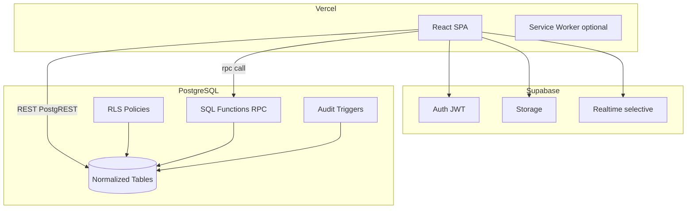
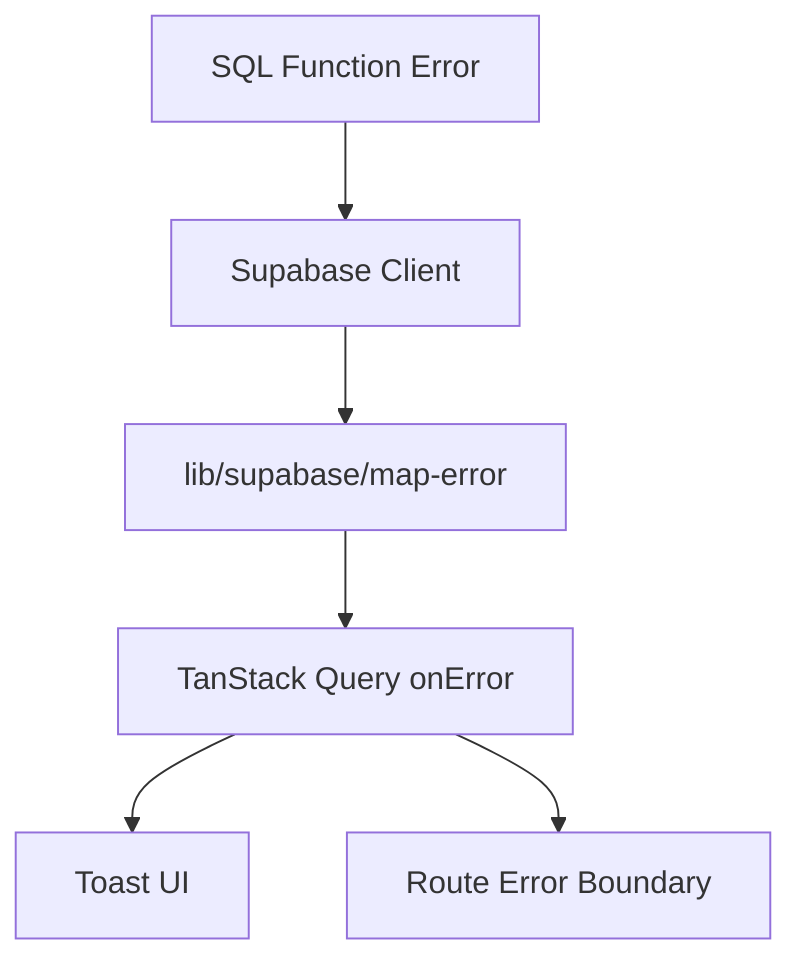

# NIHA POS — Software Architecture

**Status:** Canonical (in-repo). Materialized from the approved architecture plan and current code.
**Core principle:** Thin client, thick database. PostgreSQL is the single source of truth — no
snapshot/summary tables, atomic financial transactions via SQL functions.

---

## 1. System overview



| Layer                   | Responsibility                                    | Must NOT do                                           |
| ----------------------- | ------------------------------------------------- | ----------------------------------------------------- |
| **React UI**            | Render, capture input, navigation, local draft UX | Business rules, balance math, authorization decisions |
| **TanStack Query**      | Cache server responses, orchestrate fetch/mutate  | Become a second database                              |
| **Supabase Client**     | Typed transport to PostgREST / Auth / Storage     | Hold service-role secrets                             |
| **RLS**                 | Tenant isolation, role-based row access           | Business logic                                        |
| **SQL Functions (RPC)** | Atomic transactions, invariants, financial ops    | UI concerns                                           |
| **PostgreSQL**          | Single source of truth                            | Duplicate aggregates                                  |

**Why:** No permanent Node server (stack constraint); atomic financial guarantees in SQL; one
source of truth. Rejected: BFF server, fat client, microservices, event-sourcing/CQRS.

---

## 2. Folder structure (current + planned)

```
niha-yam/
├── .github/workflows/         # CI: lint, format:check, typecheck, build
├── docs/                      # THIS documentation (source of truth)
│   └── adr/                   # Architecture Decision Records
├── public/                    # PWA manifest, icons
├── supabase/
│   ├── config.toml
│   └── migrations/            # Ordered SQL: schema, RLS, functions, triggers
├── scripts/                   # Node maintenance scripts (bootstrap, verify)
├── src/
│   ├── app/                   # Application shell only (no domain logic)
│   │   ├── providers/         # QueryClient, Auth, ErrorBoundary
│   │   ├── routes/            # Route definitions + lazy imports
│   │   ├── layouts/           # Admin / Auth / POS layouts
│   │   └── navigation/        # Nav config (U1+)
│   ├── features/              # Vertical domain slices (auth, staff, …)
│   ├── shared/                # Cross-feature, zero business rules
│   │   ├── components/ui/     # Design-system primitives
│   │   ├── components/patterns/ # Composite patterns (U1+)
│   │   ├── hooks/ utils/ constants/
│   │   └── i18n/ar/           # Arabic strings (U1+)
│   ├── lib/                   # Infrastructure adapters (supabase, query, logger)
│   ├── types/                 # database.generated.ts + shared types
│   └── main.tsx
└── package.json
```

**Rules:** `features/` vs `shared/` boundary prevents spaghetti imports. `app/` stays thin.
`lib/` is infrastructure, never product rules. Migrations co-located with app code.

---

## 3. Feature module structure

Each feature owns its UI + data access. Mandatory internal template:

```
src/features/<domain>/
├── api/            # *.api.ts (raw supabase), *.queries.ts, *.mutations.ts, *.keys.ts
├── components/     # feature-private UI
├── pages/          # route entry components
├── schemas/        # Zod schemas (forms + RPC input)
├── types/          # feature types (extend generated DB types)
├── context/        # feature providers (e.g. AuthProvider)
├── guards/         # route guards (auth)
└── index.ts        # public API — other features import ONLY from here
```

**Cross-feature rules:** import only from another feature's `index.ts`; prefer integration via
server state (query invalidation) over shared React state; no circular imports.

---

## 4. Naming conventions

| Kind               | Convention                                                | Example                                  |
| ------------------ | --------------------------------------------------------- | ---------------------------------------- |
| Folders            | kebab-case                                                | `features/order-items/`                  |
| Components / types | PascalCase                                                | `OrderSummary.tsx`, `OrderStatus`        |
| Hooks              | `use*`                                                    | `useOrders.ts`                           |
| Utilities          | kebab-case                                                | `format-currency.ts`                     |
| API files          | `*.queries.ts`, `*.mutations.ts`, `*.keys.ts`, `*.api.ts` | `staff.api.ts`                           |
| DB tables/columns  | snake_case (plural tables)                                | `order_items`, `created_at`              |
| SQL functions      | snake_case verbs                                          | `close_order`, `bootstrap_owner_staff`   |
| RLS policies       | `{table}_{action}_{role}`                                 | `orders_select_staff`                    |
| SQL migrations     | `YYYYMMDDHHMMSS_description.sql`                          | `20260707100000_m1_enums_and_tables.sql` |

Path alias: `@/` → `src/`.

---

## 5. State management

| State type     | Tool                                                          |
| -------------- | ------------------------------------------------------------- |
| Server state   | TanStack Query                                                |
| URL state      | React Router `searchParams`                                   |
| Auth session   | Supabase Auth + thin React Context (`AuthProvider`)           |
| App context    | React Context (minimal): current `branchId`, active `shiftId` |
| Ephemeral UI   | `useState` / `useReducer`                                     |
| POS draft cart | `useReducer` in `orders` feature — not persisted as truth     |

**Hard rules:** no Redux/Zustand/Jotai unless a measured need arises; no mirroring server data in
Context; financial balances never stored in client state (always refetched after mutation).

---

## 6. TanStack Query strategy

- QueryClient defaults: `staleTime` 30s (5min for menu), `gcTime` 10min, `retry` 2 (network only),
  `refetchOnWindowFocus` true for admin / false for POS terminal, `refetchOnReconnect` true.
- Per-feature query key factories — no inline string arrays in components.
- **Financial mutations:** no optimistic update; show loading; await RPC; invalidate specific keys.
- Narrow invalidation (close order → that order + list, not whole cache).

---

## 7. Error handling



1. SQL functions raise structured errors (`ERRCODE` + message) — no silent failures.
2. `mapSupabaseError()` → `AppError { code, userMessage, isRetryable }`.
3. Global mutation `onError` → toast + logger; queries show inline error UI with retry.
4. Route + root error boundaries catch render crashes.

| Code            | UX                    | Retry |
| --------------- | --------------------- | ----- |
| `NETWORK`       | "Connection lost"     | Yes   |
| `AUTH`          | Redirect to login     | No    |
| `PERMISSION`    | "Not allowed"         | No    |
| `VALIDATION`    | Inline field errors   | No    |
| `BUSINESS_RULE` | Specific message      | No    |
| `UNKNOWN`       | Generic + support ref | Maybe |

---

## 8. Security & secrets

- **Auth:** Supabase Auth (email/password; OAuth later).
- **Authorization:** RLS on **every** table; no public-read shortcuts.
- **Tenant isolation:** `restaurant_id` on all tenant data; branch scope via `staff_branches`.
- **Roles:** `owner`, `manager`, `cashier`, `waiter`, `kitchen` — enforced in RLS + RPC guards.
- **RPC:** default `SECURITY INVOKER`; `SECURITY DEFINER` only for controlled elevation with
  explicit checks and fixed `search_path`.
- **Idempotency:** required on order/payment RPCs (future modules).

### Secrets policy (enforced)

| Secret                                        | Where it lives                                    | Never                                                                            |
| --------------------------------------------- | ------------------------------------------------- | -------------------------------------------------------------------------------- |
| `VITE_SUPABASE_URL`, `VITE_SUPABASE_ANON_KEY` | Frontend env (bundled)                            | —                                                                                |
| `SUPABASE_SERVICE_ROLE_KEY`                   | `.env.local` on developer machine + CI setup only | Never `VITE_`-prefixed; never imported in `src/`; never bundled; never committed |

Only variables prefixed `VITE_` are exposed to the React bundle by Vite. The service-role key is
used **exclusively** by `scripts/bootstrap-owner.mjs` for one-time owner setup. See
[ADR-0003 style secrets note](./adr/) and the bootstrap flow in [workflows.md](./workflows.md).

---

## 9. Deployment

| Env        | Frontend          | Supabase               |
| ---------- | ----------------- | ---------------------- |
| local      | Vite dev          | Cloud dev/prod project |
| preview    | Vercel PR preview | dev project            |
| production | Vercel production | prod project           |

- Forward-only migrations in production; destructive changes via expand-contract.
- `.env.example` documents all vars; Vercel env vars per environment; no env-specific code branches.

---

## 10. Cross-cutting concerns (designed, phased)

- **Offline:** tiered — app shell (SW) → read cache (Query) → write queue (IndexedDB + idempotency).
  Full offline-first replication rejected. (Enabled in POS/payment modules.)
- **Realtime:** channel per `branch_id` + topic; unsubscribe on route leave. (Kitchen module.)
- **Logging:** client `lib/logger` structured JSON; server `audit_log` append-only. Never log
  passwords, PINs, tokens, full card numbers.
- **Printing:** fully decoupled from sales; local queue + bridge. See
  [printing-architecture.md](./printing-architecture.md).

---

## 11. Key risks (tracked)

| Risk                        | Mitigation                                                           |
| --------------------------- | -------------------------------------------------------------------- |
| RLS policy complexity drift | One policy set per table; ADR for changes; tests                     |
| SQL function testability    | Integration tests against Supabase; never deploy untested RPC        |
| SECURITY DEFINER misuse     | Minimal use; explicit tenant checks inside function                  |
| Offline queue edge cases    | Idempotency keys; manual reconciliation UI                           |
| Migration failures in prod  | Staging replay; backup before migrate; rollback runbook              |
| Regulatory (PCI/tax)        | Never store raw card data; tokenization; tax rules in SQL with audit |
