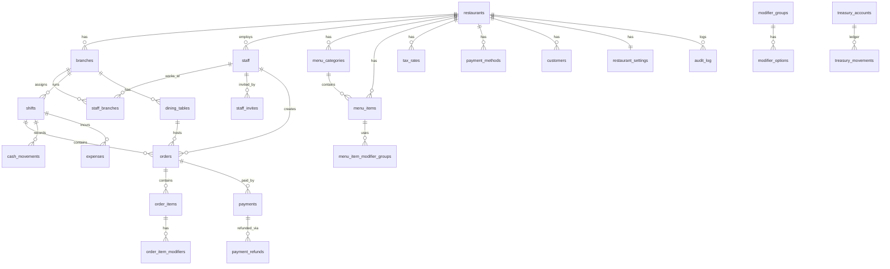
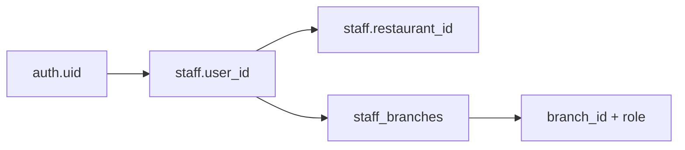

# NIHA POS — Domain Model

**Status:** Canonical (in-repo). Materialized from the approved database plan.
**Legend:** ✅ implemented (migrated) · 🎯 designed / future module.

Money is always `numeric(12,2)` (never float). No summary/aggregate tables — reports compute from
source. Financial line data is frozen at sale time (immutable audit record, not a summary).

**Scope ([ADR-0017](./adr/0017-single-restaurant-scope.md)):** the system runs **one restaurant, one
branch**. `restaurant_id` / `branch_id` columns and RLS helpers are retained (they keep RLS correct
and preserve a future multi-branch option), but they always resolve to _the_ single restaurant/branch
— no module enumerates or switches among many.

---

## 1. ER diagram (full target model)

---

## 2. Enums

| Type                  | Values                                                  | Status |
| --------------------- | ------------------------------------------------------- | ------ |
| `staff_role`          | owner, manager, cashier, waiter, kitchen                | ✅     |
| `order_type`          | dine_in, takeaway, delivery                             | 🎯     |
| `order_status`        | draft, open, in_progress, ready, served, closed, voided | 🎯     |
| `order_item_status`   | pending, sent, preparing, ready, served, voided         | 🎯     |
| `payment_status`      | completed, voided, refunded                             | 🎯     |
| `payment_method_type` | cash, card, wallet, other                               | 🎯     |
| `shift_status`        | open, closed                                            | 🎯     |
| `cash_movement_type`  | pay_in, pay_out                                         | 🎯     |
| `stock_movement_type` | purchase, sale_deduction, adjustment, waste, transfer   | 🎯     |
| `discount_type`       | percentage, fixed                                       | 🎯     |
| `table_status`        | available, occupied, reserved, inactive                 | 🎯     |

---

## 3. Implemented entities (M1) ✅

### `restaurants`

Tenant root. `id`, `name`, `slug` (unique), `currency_code`, `timezone`, `is_active`, timestamps.

### `branches`

`id`, `restaurant_id` FK, `name`, `code` (unique per restaurant), `is_active`, timestamps.

### `staff`

Maps one `auth.users` row to one restaurant. `id`, `user_id` (unique FK → auth.users),
`restaurant_id` FK, `display_name`, `pin_hash` (nullable, bcrypt for POS PIN), `is_active`,
timestamps.

### `staff_branches`

Branch-scoped roles. Composite PK `(staff_id, branch_id)`, `role` (`staff_role`), `created_at`.

### `staff_invites` — ⚠️ deprecated ([ADR-0018](./adr/0018-direct-staff-creation.md))

`id`, `restaurant_id`, `email`, `display_name`, `branch_assignments` (jsonb), `token` (unique),
`invited_by`, `expires_at`, `accepted_at`, `created_at`. **Retired in M2 (Staff-rework):** staff are
created directly by a manager (username + password/PIN); invite links and email signup are removed.

### `audit_log` (M1 scope)

Append-only. In M1 the `action` column is constrained to an **allowlist of Auth + Staff events
only** (no financial/order events yet):

- Auth: `auth.login`, `auth.login_failed`, `auth.logout`, `auth.password_reset_requested`,
  `auth.signup_completed`
- Staff: `staff.invited`, `staff.created`, `staff.updated`, `staff.deactivated`, `staff.pin_set`,
  `staff.pin_verify_failed`
- Bootstrap: `staff.owner_bootstrapped`

M2 (Staff-rework, [ADR-0018](./adr/0018-direct-staff-creation.md)) makes `staff.created` the direct
creation event and retires `staff.invited` / `auth.signup_completed`. Future modules widen this
allowlist as financial/order events are introduced.

---

## 4. Key invariants

| Invariant                                               | Enforced by                                  |
| ------------------------------------------------------- | -------------------------------------------- |
| One `staff` row per `auth.users` user                   | `uq_staff_user` unique on `user_id`          |
| Staff belongs to exactly one restaurant                 | `staff.restaurant_id` NOT NULL               |
| Branch role scoped per branch                           | `staff_branches` composite PK + `role`       |
| First owner created once, only when `staff` empty       | `bootstrap_owner_staff` guard (service role) |
| Cannot remove the last owner                            | staff update RPC guard (M1/M2)               |
| One open shift per branch                               | partial unique index (🎯 M4)                 |
| Treasury balance = SUM(movements)                       | no balance column; computed (🎯 M4)          |
| Order totals: `total = subtotal - discount + tax`       | CHECK constraint (🎯 M5)                     |
| Financial writes only via RPC                           | RLS blocks direct client writes (🎯 M4+)     |
| Order line name/price frozen at sale                    | copied into `order_items` (🎯 M5)            |
| Financial ops never edited/deleted; undo = reversal txn | ADR-0005 lifecycle + `reverses_id` (🎯 M4+)  |

---

## 5. Future entities (designed) 🎯

Grouped by delivering module (single-restaurant, operations-first — see [modules.md](./modules.md)):

- **M2 Staff (rework):** ✅ delivered — direct creation via Edge Functions + `provision_staff`;
  username login (`<username>@staff.niha.local`); `staff_invites` retired at RPC/trigger level
  ([ADR-0018](./adr/0018-direct-staff-creation.md), [ADR-0019](./adr/0019-edge-functions-privileged-operations.md)).
- **M3 Menu & Products:** `menu_categories`, `menu_items` (POS operational flags per
  [ADR-0020](./adr/0020-operations-first.md): `show_in_pos`, `sort_order`, `needs_kitchen`,
  `needs_print`, `accepts_modifiers`, `allows_discounts`, `is_open_price`, `is_active`), full
  `modifier_groups`, `modifier_options`, `menu_item_modifier_groups`; `list_menu_for_pos` RPC as M5
  contract. **No tax in M3.** Legacy menu import (~12 categories, ~54 products) runs **after** M3
  approval — not during M3 implementation.
- **M4 Treasury & Payment Methods:** `payment_methods`, `treasury_accounts`, `treasury_movements`,
  `cash_movements`.
  - **Multi-treasury (F1, planning — [ADR-0013](./adr/0013-multi-treasury-foundation.md)):** many
    independent treasuries (cash/cards/InstaPay/e-wallets/…), each with its own append-only ledger and
    **computed** balance; `treasury_transfers` recorded as two linked movements (debit + credit) under
    the F1 lifecycle; `payment_method_treasury` mapping kept in settings (config, not code).
- **M5 POS & Orders:** `dining_tables` (optional), `orders`, `order_items`, `order_item_modifiers`,
  `order_discounts`, `payments`, `payment_refunds`, `idempotency_keys`, order sequence.
- **M6 Printing:** `printers`, `kitchen_departments`, `department_printers`, `menu_item_departments`,
  `receipt_templates`, `print_logs` (see [ADR-0029](./adr/0029-m6-printing-before-kds.md)).
- **M7 KDS (deferred):** consumes order events / print jobs; no separate kitchen SSOT.
- **Backlog (deferred):** `customers`; `expense_categories`/`expenses` (under F1); `ingredients`,
  `recipes`, `recipe_ingredients`, `stock_movements` (inventory).
- **F1 Financial Approval Foundation (planning):** lifecycle/approval fields on financial records (`status`,
  `created_by`, `approved_by`, `rejected_by`, `*_at` timestamps, `rejection_reason`,
  `reversal_reason`, `reverses_id`) and/or a shared `approval_requests` table — per
  [ADR-0005](./adr/0005-financial-approval-and-reversal-model.md); plus multi-treasury entities per
  [ADR-0013](./adr/0013-multi-treasury-foundation.md).
- **F2 Authorization & Permissions Foundation (planning):** data-driven `roles`, `permissions`,
  `role_permissions`, per-user `user_permissions` overrides, optional `permission_groups`, RLS keyed
  off permissions, and audit of permission changes — per
  [ADR-0012](./adr/0012-authorization-permissions-foundation.md). Until then, authorization is
  role-derived in `permissions.ts`.

Full column-level specs live in the approved database plan and are added to this doc as each module
is implemented.

---

## 6. RLS auth resolution

Helper functions (SECURITY DEFINER, fixed `search_path`): `auth_staff_id()`,
`auth_restaurant_id()`, `has_branch_access(branch_id)`, `has_branch_role(branch_id, role)`,
`is_owner_or_manager()`. JWT custom claims for `restaurant_id` were rejected (stale on deactivate);
DB lookup is authoritative.
