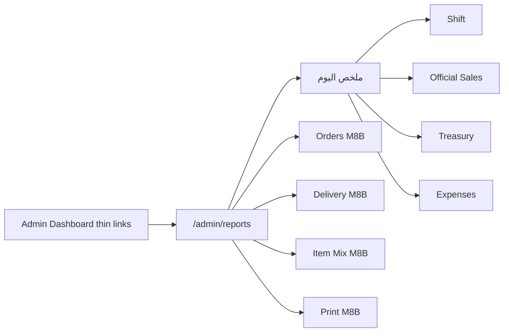

# M8 — Reports (Plan Gate)

**Status:** ✅ **Approved** (2026-07-12) — product owner locked Q-R1…Q-R8, R-1…R-12, **ملخص اليوم**, and ADR-0032  
**Date:** 2026-07-12 · **Approved:** 2026-07-12  
**Module:** M8 — Reports  
**Depends on:** M4–M6 ✅ Approved · **POS feature freeze** · **Printing feature freeze**  
**M7 KDS:** remains **deferred** ([ADR-0029](./adr/0029-m6-printing-before-kds.md)) — not a dependency  
**Methodology:** Plan → Review → Approve → Implement → Test → Final Review  
**ADR:** [ADR-0032](./adr/0032-reports-compute-from-source.md) — ✅ **Accepted** with this plan  

> **M8 Status:** ✅ **Module Approved (2026-07-12)** — [m8-final-review.md](./m8-final-review.md) · **Reports Feature Freeze** · **Operational Version 1.0**  
> No new report product features without a new Plan cycle. Next roadmap pick comes from live ops needs.

---

## Approval record

| Item | Decision |
| ---- | -------- |
| **R-1 … R-12** | ✅ **Approved as written** (locked principles) |
| **Q-R1 … Q-R8** | ✅ **Approved** — see §12 |
| **ملخص اليوم (S0)** | ✅ **Approved** — landing page inside `/admin/reports`; composes S1–S4 RPCs only; no new math engine |
| **Slice order** | ✅ **M8A = S0 + S1–S4** → close → then **M8B = S5–S8** |
| **ADR-0032** | ✅ **Accepted** (2026-07-12) |
| **Export M8A** | Browser Print + CSV only (no PDF) |
| **Date range M8A** | Hard cap **31 days** |
| **Cashier access** | Reports module **denied**; POS shift summary only |
| **Report-view audit** | **Not in M8A**; optional M8B if real need |

### Operational amendments locked at Approve

| ID | Amendment |
| -- | --------- |
| **A1** | Independent module route **`/admin/reports`**; Admin Dashboard is a **thin pointer** only (not a second calculator). |
| **A2** | Landing page **ملخص اليوم (S0)** aggregates existing report RPCs for today / open shift — no duplicate formulas in React. |
| **A3** | Cancelled / voided / partially voided orders: **separate column or section only** — never inside official sales (Q-R8). |
| **A4** | Item mix (S7, M8B): line totals **as sold**, including modifiers in the sold line total (Q-R7). |

---

## 1. Objective

Give Niha Yam management a **trustworthy, Arabic-first, read-only** view of the restaurant day:

> What did we sell? · What money is **officially** in each treasury? · What happened on this shift? ·  
> Where is cash variance? · What is still pending approval?

M8 **does not create money**. It **reads** the SSOT already written by M4/M5/M6 and presents it as
reports. All figures are **computed from source tables** at query time — never from summary /
snapshot tables ([ADR-0005](./adr/0005-financial-approval-and-reversal-model.md),
[ADR-0013](./adr/0013-multi-treasury-foundation.md), [ADR-0032](./adr/0032-reports-compute-from-source.md),
[domain-model.md](./domain-model.md)).

```
Orders · order_payments · treasury_movements · expenses · shifts · print_jobs
                              │
                              ▼
                    Report RPCs (server-computed)
                              │
                              ▼
                    Admin Reports UI (read-only)
                         │
                    ملخص اليوم → S1…S8 detail
```

---

## 2. Locked principles (R-1 … R-12) — **Approved**

| ID | Principle |
| -- | --------- |
| **R-1** | **Read-only.** Reports never insert/update financial rows, never “fix” money, never approve collections/expenses. |
| **R-2** | **Compute from source.** No `daily_sales_summary`, no materialised rollups as SSOT. Optional short-lived cache (TanStack Query) is UI-only. |
| **R-3** | **Official ≠ operational.** Official revenue / balances = **approved ledger** only ([ADR-0025](./adr/0025-revenue-collection-approval.md) P-7). Operational drawer (pending cash ± pending expenses) may appear only when **explicitly labeled** “تشغيلي”. |
| **R-4** | **Pending never looks like revenue.** Pending collections / pending expenses are separate sections or badges — never mixed into “إجمالي المبيعات الرسمية”. |
| **R-5** | **Reversals visible.** Append-only history: original + reversal both appear; no silent netting that hides corrections ([ADR-0005](./adr/0005-financial-approval-and-reversal-model.md)). |
| **R-6** | **Per-treasury.** Multi-treasury reports stay independent; transfers show as two linked legs ([ADR-0013](./adr/0013-multi-treasury-foundation.md)). |
| **R-7** | **Server-computed.** All money math in SQL RPCs. React renders; never re-implements balance formulas. |
| **R-8** | **Single restaurant.** No multi-branch / org rollups ([ADR-0017](./adr/0017-single-restaurant-scope.md)). |
| **R-9** | **Arabic-first / RTL** UI; numbers `dir=ltr` where helpful. |
| **R-10** | **Capability `reports.view`** (owner/manager only). Cashiers keep shift-close KPIs on POS; they do **not** get the Reports module (Q-R3). |
| **R-11** | **Freeze respect.** M8 may **read** POS/Treasury/Print data; it must not reopen M5/M6 product scope (no new order flows, no Bridge features). |
| **R-12** | **Audit of report views** is **out of M8A**; may be added in **M8B** only if a real need appears (Q-R6). |

---

## 3. In scope / Out of scope

### In scope — M8 (product)

| # | Area | Outcome | Slice |
| - | ---- | ------- | ----- |
| 0 | **ملخص اليوم (S0)** | Landing page: composed KPIs from S1–S4 RPCs for today / open shift | **M8A** |
| 1 | **Reports module** | `/admin/reports` + nav **التقارير** + `reports.view` | **M8A** |
| 2 | **Shift / end-of-day (S1)** | Full shift report incl. closed shifts | **M8A** |
| 3 | **Official sales (S2)** | Date-range approved-only sales | **M8A** |
| 4 | **Treasury & cash (S3)** | Balances + ledger with date filters | **M8A** |
| 5 | **Expenses (S4)** | Approved vs pending | **M8A** |
| 6 | **Export** | Browser print + CSV (no PDF in M8A) | **M8A** |
| 7 | **Orders ops summary (S5)** | Status × type; cancelled separate | **M8B** |
| 8 | **Delivery by driver (S6)** | Ops | **M8B** |
| 9 | **Item / category mix (S7)** | Line totals as sold (incl. modifiers) | **M8B** |
| 10 | **Print reliability (S8)** | Ops | **M8B** |
| 11 | **Dashboard thin links** | `/admin` points into Reports; no second math engine | **M8A** |
| 12 | **Automated suite** | `pnpm test:m8` | **M8A** (money) · extend in **M8B** |

### Explicitly out of scope

| Out | Why |
| --- | --- |
| **M7 KDS** | Deferred |
| **BI warehouse / ETL / summary SSOT tables** | ADR-0032 / ADR-0005 |
| **Editing / approving money from Reports** | M4/M5 screens |
| **Tax / ZATCA / inventory / P&L** | Not in product |
| **PDF export** | Backlog (Q-R4) |
| **Cashier Reports module** | Q-R3 |
| **Report-view audit in M8A** | Q-R6 |
| **M5/M6 feature work** | Feature freezes |
| **M8B before M8A Approved** | Slice gate |

---

## 4. Report catalog

### Mode legend

| Mode | Meaning |
| ---- | ------- |
| **Official** | Approved ledger / approved collections only |
| **Operational** | Includes pending effects — labeled **تشغيلي** |
| **Ops** | Non-financial operational metrics |

| ID | Report | Mode | Slice | Notes |
| -- | ------ | ---- | ----- | ----- |
| **S0** | **ملخص اليوم** | Official + Operational (labeled) | **M8A** | Landing; composes existing RPCs — see §4.1 |
| **S1** | **تقرير الوردية** | Official + Operational sections | **M8A** | Extend `get_shift_report` to closed shifts |
| **S2** | **المبيعات الرسمية** | Official | **M8A** | By day / method / order type; cancelled excluded |
| **S3** | **أرصدة الخزائن + كشف الحركة** | Official | **M8A** | Max range 31 days |
| **S4** | **المصروفات** | Official + Pending section | **M8A** | Approved vs pending |
| **S5** | **ملخص الطلبات** | Ops + Official totals | **M8B** | Cancelled = separate column/section (Q-R8) |
| **S6** | **التوصيل حسب السائق** | Ops | **M8B** | |
| **S7** | **خليط الأصناف / الفئات** | Ops | **M8B** | Line totals as sold incl. modifiers (Q-R7) |
| **S8** | **موثوقية الطباعة** | Ops | **M8B** | |

**Reuse first:** `get_shift_report`, `get_treasury_balances`, `get_treasury_ledger`, pending summary RPCs — wrap or extend rather than rewrite.

### 4.1 ملخص اليوم (S0) — locked

Not a new Dashboard and **not** a new calculation engine. It is the **default landing page** inside `/admin/reports`.

**Purpose:** quick management entry before opening detail reports.

**Example KPIs (composed from S1–S4 / existing helpers):**

| KPI | Mode |
| --- | ---- |
| إجمالي المبيعات الرسمية | Official |
| المبيعات حسب وسيلة الدفع | Official |
| عدد الطلبات (اليوم / الوردية) | Ops count (define: non-cancelled vs all — cancelled broken out) |
| داخل المطعم / استلام / دليفري | Ops / official totals as applicable |
| المصروفات المعتمدة | Official |
| التحصيلات المعلقة | Pending (not revenue) |
| المصروفات المعلقة | Pending |
| الرصيد التشغيلي الحالي | Operational (labeled **تشغيلي**) |
| أهم التنبيهات | Ops (e.g. pending count, variance open shift) |

**Rules:**

- UI only **displays** RPC payloads; no client-side money formulas.  
- Prefer one composition RPC (e.g. `report_today_summary`) that **calls the same SQL helpers** as S1–S4, **or** parallel queries to those RPCs — either way, **one formula path**.  
- Deep-links from each KPI card → S1 / S2 / S3 / S4 detail.

---

## 5. Data sources (SSOT map)

| Domain | Tables (read) | Existing RPCs to leverage |
| ------ | ------------- | ------------------------- |
| Money | `treasury_movements`, `treasuries`, `treasury_transfers`, `expenses` | `treasury_balance`, `get_treasury_balances`, `get_treasury_ledger` |
| Shift | `shifts` | `get_open_shift`, `get_shift_report` |
| Sales | `orders`, `order_items`, `order_item_modifiers`, `order_payments` | date-range aggregates (new report RPCs) |
| Pending (display only) | pending collections / expenses | `m5b_pending_*`, `list_pending_*` |
| Delivery | driver FKs | `list_delivery_drivers` |
| Print | `print_jobs`, `print_attempts` | `list_print_jobs` |

**Invariant (official sales):**

```
official_revenue(period) =
  SUM(approved collection net amounts in period)
  ≡ consistent with treasury_movements posted from approved collections
```

Pending collections **excluded**. Rejected collections **excluded**.  
Cancelled / voided orders **never** in official sales (Q-R8).  
Reversals **visible**.

---

## 6. UI design

### Navigation (locked — Q-R1)

| Surface | Role |
| ------- | ---- |
| **`/admin/reports`** | **Sole Reports module.** Default child: **ملخص اليوم (S0)**. Nav: **التقارير**. Gated by `reports.view`. |
| **`/admin` Dashboard** | **Thin pointer only** — short links/cards into Reports; **no** independent KPI math. |
| **Treasury page** | Unchanged money workspace; optional deep-links to S3/S4 |
| **POS ShiftSummary** | Unchanged cashier close UX (Q-R3) |

### Screen composition (Arabic RTL)

1. **ملخص اليوم** — first viewport inside Reports.  
2. **Report catalog** — cards/links to S1…S8 (S5–S8 disabled or hidden until M8B).  
3. **Filter bar** — date from/to (≤ 31 days in M8A) · shift picker · treasury · method.  
4. **Report body** — KPI strip + table + drill-down to existing order detail where useful.  
5. **Export** — طباعة · CSV (M8A).  
6. **Mode badge** — `رسمي` / `تشغيلي` always when operational figures shown.



---

## 7. Performance & computation

| Rule | Approach |
| ---- | -------- |
| Default range | **Today** or **open / last closed shift** |
| Max range **M8A** | **31 days** hard cap in RPC (Q-R5) — reject longer |
| Aggregation | SQL inside SECURITY DEFINER RPCs |
| Indexes | Add only if proven at Implement — still no summary tables |
| Caching | Short TanStack `staleTime`; Refresh button |
| S0 | Same helpers as S1–S4 — no divergent formulas |

**Rejected:** client-side summing of large order lists; summary SSOT tables; background balance rewriters.

---

## 8. Permissions & security (locked — Q-R3)

| Capability | Who | Access |
| ---------- | --- | ------ |
| **`reports.view`** | `owner`, `manager` | Full `/admin/reports` incl. S0 |
| `treasury.manage` | owner/manager | Unchanged |
| `pos.access` | cashier+ | POS shift summary **only** |
| Cashier → `/admin/reports` | — | **Denied** |

- RLS restaurant-scoped.  
- RPCs: manager/reports viewer gate.  
- CSV = same as view.  
- No `report.viewed` audit in M8A (Q-R6).

---

## 9. Proposed RPC surface (design names)

| RPC | Purpose | Slice |
| --- | ------- | ----- |
| `report_today_summary(...)` | S0 composition via shared helpers | M8A |
| `list_shifts_for_reports(from, to)` | Shift picker | M8A |
| `get_shift_report(shift_id)` | Extend for closed-shift parity | M8A |
| `report_official_sales(from, to, filters)` | S2 | M8A |
| `report_expenses(from, to)` | S4 | M8A |
| Existing treasury RPCs | S3 | M8A |
| `report_orders_summary` | S5 | M8B |
| `report_delivery_by_driver` | S6 | M8B |
| `report_item_mix` | S7 | M8B |
| `report_print_reliability` | S8 | M8B |

All money payloads declare `mode: 'official' | 'operational' | 'ops'` where relevant.

---

## 10. Implementation slices

| Slice | Content | Exit criteria |
| ----- | ------- | ------------- |
| **M8A** | `reports.view` · `/admin/reports` · **S0 ملخص اليوم** · **S1–S4** · Dashboard thin links · CSV/print · `test:m8` money rules · 31-day cap | ✅ **Approved (2026-07-12)** — [m8a-final-review.md](./m8a-final-review.md) |
| **M8B** | **S5–S8** · optional report-view audit · optional S7 chart | ⏸ Blocked until M8A accepted + explicit kickoff |
| **M8 Final Review** | Full suite + manual checklist | After M8B |

**Gate:** M8B must not start before M8A is formally approved.

---

## 11. Acceptance criteria & tests

### M8A product acceptance

| # | Criterion |
| - | --------- |
| AC1 | Official sales for a known day matches sum of approved collections |
| AC2 | Pending collection does **not** increase official revenue (incl. on S0) |
| AC3 | Pending expense does **not** change official treasury KPIs |
| AC4 | Closed shift report variance correct |
| AC5 | Date range > 31 days rejected |
| AC6 | Reversal visible on ledger |
| AC7 | Cashier cannot open `/admin/reports` |
| AC8 | Manager: CSV for S2 + browser print for S1/S0 |
| AC9 | S0 KPIs match detail reports for the same period (shared helpers) |
| AC10 | Cancelled orders absent from official sales |
| AC11 | Arabic RTL; mode badges on operational figures |
| AC12 | `pnpm test:m8` green; typecheck/lint green |

### Automated suite (`pnpm test:m8`) — M8A

- Fixtures: paid / unpaid / pending / approved / rejected / expense pending+approved / cancelled  
- Assert official KPIs + S0 parity  
- Assert cashier permission rejection  
- Assert 31-day rejection  

---

## 12. Review decisions (Q-R1 … Q-R8) — **Approved**

| ID | Decision |
| -- | -------- |
| **Q-R1** | **`/admin/reports`** as independent module; Dashboard is a **short pointer** only. |
| **Q-R2** | **M8A = S0 + S1–S4**; **M8B = S5–S8**. |
| **Q-R3** | Cashier **does not** see Reports; POS shift summary only. |
| **Q-R4** | M8A: **Browser Print + CSV** only; **no PDF**. |
| **Q-R5** | M8A max period: **31 days**. |
| **Q-R6** | **No** report-view audit in M8A; defer to M8B if needed. |
| **Q-R7** | Item mix uses **sold line totals including modifiers**. |
| **Q-R8** | Cancelled / partially cancelled: **separate section/column only** — **never** in official sales. |

---

## 13. Risks

| Risk | Mitigation |
| ---- | ---------- |
| Official vs operational confusion | Mode badges; Arabic copy review |
| S0 formula drift from S1–S4 | Shared SQL helpers only |
| Slow wide ranges | 31-day cap; default today |
| Scope creep before M8A close | M8B hard gate |
| Touching M5/M6 freezes | Read-only RPCs only |

---

## 14. ADR

| ADR | Status | Role |
| --- | ------ | ---- |
| [ADR-0032](./adr/0032-reports-compute-from-source.md) | ✅ **Accepted** | Compute-from-source; official vs operational |
| ADR-0005 / 0013 / 0025 / 0028 | Accepted | Foundations |
| ADR-0029 | Accepted | M7 deferred |

---

## 15. After this Approve

1. ✅ Plan + ADR-0032 locked.  
2. **Implement M8A only** (S0 + S1–S4).  
3. Test → M8A Final Review → Approve.  
4. Only then Plan/Implement **M8B**.

---

## 16. Document control

| Doc | Role |
| --- | ---- |
| This file | Approved Plan SSOT for M8 |
| [modules.md](./modules.md) | Status ledger |
| [ADR-0032](./adr/0032-reports-compute-from-source.md) | Architectural lock |
| [m6-final-review.md](./m6-final-review.md) | Prior module closed · Printing freeze |
