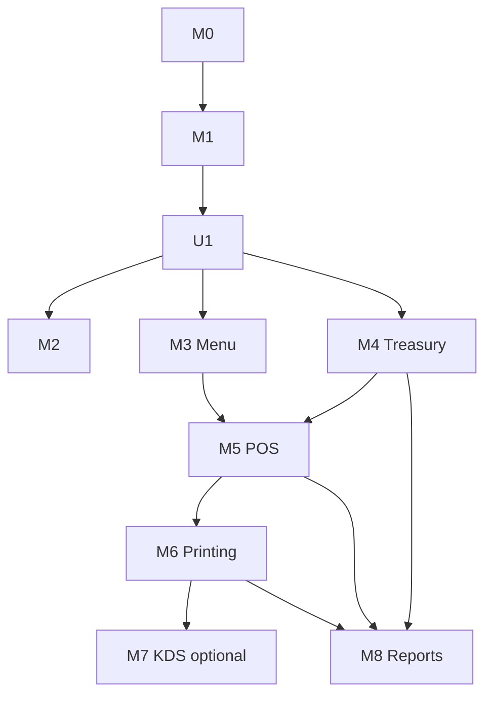

# NIHA POS — Module Sequence & Status

**Scope:** single restaurant (Niha Yam) — **not multi-tenant** ([ADR-0017](./adr/0017-single-restaurant-scope.md)).
Principle: _build what we need today, designed so it does not block future expansion, without adding
complexity that does not serve the real operation._

**Workflow per module:** Plan → Review → Approve → Implement → Test → **Final Review (one)** → Module Approved.
Do not start module N until N−1 is approved. Foundation tracks (U*) may be inserted between
feature modules when a cross-cutting foundation is needed.

## Status ledger

Roadmap is **operations-first**: get one restaurant selling, paying, cooking, printing, and reporting
as fast as possible. Multi-restaurant / organization concepts are dropped (ADR-0017); staff onboarding
switches from invite links to direct creation (ADR-0018).

> **Operational Version 1.0 (2026-07-12):** M0–M6 + M8 Approved. Core loop is live-ready.  
> **Phase 1 feature freezes:** POS (M5) · Printing (M6) · Reports (M8).  
> **Phase 2 (current):** [Vision 2.0](./niha-erp-vision-2.0.md) ✅ · **Recipes (RCA)** ✅ + freeze · **Inventory (INVA)** ✅ + freeze.  
> **Operational Completion v1.1** ✅ · [plan](./operational-completion-v1.1-plan.md) · [final review](./operational-completion-v1.1-final-review.md).  
> **Operational Hardening v1.1** ✅ · [plan](./operational-hardening-v1.1-plan.md) · [final review](./operational-hardening-v1.1-final-review.md).  
> **Production Chaos & Simulation** ✅ · [plan](./production-chaos-suite-plan.md) · [final review](./production-chaos-final-review.md).  
> **Operational Polish v1.2** ✅ · [plan](./operational-polish-v1.2-plan.md) · [final review](./operational-polish-v1.2-final-review.md) · **Operational Freeze (final)** · Feedback Center + Arabic cashier UX.  
> **Official Baseline:** [NIHA ERP Operational v1.1](./release-operational-v1.1.md) · tag `v1.1.0-production` · App **1.1.0**.  
> **Print Bridge baseline:** **0.5.0** — dual-environment connections ([print-dual-env-testing.md](./print-dual-env-testing.md)); do not change multi-connection behavior without explicit review.  
> Ops area: **bug / perf / simple UX only** — no new ops features.  
> **Purchasing:** **PURA/PURB ✅ Production + Freeze** · **PURC = next** (kickoff pending).  
> **Printing:** **Feature Freeze مغلق** — Bridge **0.5.0** baseline · Hotfix **0.5.8** portable ownership.  
> **Liquidity + Smart Handover Sheet:** ✅ **Production + Feature Freeze** (2026-07-16).  
> **Test policy:** [ADR-0035](./adr/0035-production-readonly-tests.md) — smoke/test/sim/fuzz/chaos **never mutate Production** (Testing only for writes).  
> **M7 KDS** remains deferred until paper workflow needs a screen.

| #      | Module                           | Scope summary                                                                                                                                                                                                            | Depends on | Status                                                                     |
| ------ | -------------------------------- | ------------------------------------------------------------------------------------------------------------------------------------------------------------------------------------------------------------------------ | ---------- | -------------------------------------------------------------------------- |
| M0     | Foundation                       | Repo scaffold, Vite/React/TS/Tailwind, ESLint, CI, Supabase wiring, env template                                                                                                                                         | —          | ✅ Signed off                                                              |
| M1     | Auth & Staff (invite-based)      | Supabase Auth, `staff`, `staff_branches`, login, PIN, RLS helpers, audit (auth/staff)                                                                                                                                    | M0         | ✅ Signed off — onboarding reworked in M2 (ADR-0018)                       |
| **U1** | App Foundation                   | Arabic/RTL, design tokens, admin shell, components, patterns, design-system, docs                                                                                                                                        | M1         | ✅ Signed off                                                              |
| M2     | Staff (Direct Creation) — rework | Manager creates staff directly (name, username, password/PIN, role, status); username+password login via internal synthesized email; retire invites                                                                      | U1         | ✅ Approved (2026-07-08)                                                   |
| M3     | Menu & Products                  | POS-oriented catalog: categories, items (operational flags incl. `is_favorite` S7), full modifiers; `list_menu_for_pos` for M5; **no tax**; legacy import after M3 approval ([ADR-0020](./adr/0020-operations-first.md)) | U1         | ✅ Approved (2026-07-08) · Legacy import done (12 categories, 56 products) |
| M4     | Treasury & Money Flow            | Multi-treasury accounts + append-only ledger (F1), shifts + reconciliation, cash drop, **general any→any transfers**, expenses, deposit/withdrawal, financial references, computed balances/reports; config-driven payment-method linkage                                                                                                                         | U1         | ✅ Approved (2026-07-08) — 26/26 E2E (`pnpm test:m4`); general transfers verified |
| M5     | POS & Orders                     | **M5A** POS Core · **M5B** Orders hub, Delivery, customers, collection approval, timeline · **M5C** Pending free-edit, review queue, financial-only post-approve · pending expense lifecycle ([ADR-0024](./adr/0024-order-lifecycle-three-dimensions.md)–[ADR-0028](./adr/0028-pending-expense-approval-lifecycle.md)) | M3, M4     | ✅ **Approved (2026-07-09)** — M5A/B/C · all suites green · **POS feature freeze** (bug/perf/UX only; functional work → **M6 Printing**) |
| **M6** | **Printing & Order Execution**   | M6A · M6B Bridge+TTL · M6C **Print Center only** ([ADR-0030](./adr/0030-niha-print-bridge.md) BP-1…**15**) · WYSIWYG · draft-orders direction [ADR-0031](./adr/0031-draft-orders-db-direction.md) · [m6-final-review.md](./m6-final-review.md) · **Print Fields Completeness** [plan](./print-fields-completeness-plan.md) · [final](./print-fields-completeness-final-review.md) · [تشخيص عربي](./print-diagnostics-plain-arabic.md) · [مطابقة ذكية](./smart-printer-rematch.md) · **Dual Env** [docs](./print-dual-env-testing.md) · Bridge **0.5.0** baseline | M5         | ✅ **Approved** · **Printing Feature Freeze** · Dual Env Printing + Bridge **0.5.0** baseline (2026-07-17) |
| M7     | Kitchen Display (KDS)            | Item/ticket status UI + Realtime — **optional consumer** of the same order events / print-job stream; no rewrite of M6                                                                                                                                 | M6         | ⏳ Deferred until paper workflow needs a screen ([ADR-0029](./adr/0029-m6-printing-before-kds.md)) |
| **M8** | **Reports**                      | Read-only compute-from-source · S0–S8 · [m8-reports-plan.md](./m8-reports-plan.md) · [m8-final-review.md](./m8-final-review.md) · [ADR-0032](./adr/0032-reports-compute-from-source.md) | M4–M6      | ✅ **Approved (2026-07-12)** — M8A+M8B · `test:m8` 25/25 · **Reports feature freeze** · **Operational V1.0** |

### Phase 2 (Restaurant ERP) — Vision Approved

Governed by [NIHA ERP Vision 2.0](./niha-erp-vision-2.0.md) · [ADR-0033](./adr/0033-niha-erp-vision-2.0.md).  
**Spine S1 (logical):** Recipes & Costing → Inventory → Suppliers & Purchasing → Payroll & HR → Promotions → AI Operating Assistant.  
**Backlog:** CRM & Customer Engagement (hooks required in Promotions/AI; no Implement now).  
**Gate:** Capability Plan Approve before any Implement. Post-Inventory reorder allowed from live ops.

| Capability | Plan / Review | Status |
| ---------- | ------------- | ------ |
| Recipes & Costing | [plan](./recipes-costing-plan.md) · [final review](./recipes-costing-final-review.md) | ✅ **RCA Approved (2026-07-12)** · **Recipes Feature Freeze** · RCB deferred |
| Inventory — **INVA** | [plan](./inventory-plan.md) · [INVA final review](./inventory-final-review-inva.md) | ✅ **INVA Approved (2026-07-12)** · `test:inventory` 20/20 · **Inventory Feature Freeze (INVA)** |
| Inventory — **INVB** | — | ⏸ Blocked — spine candidate; **not** auto-next if live ops prioritize Purchasing |
| Inventory — **INVC** | — | ⏸ After INVB (if counts land before consumption) |
| Suppliers & Purchasing | [plan](./suppliers-purchasing-plan.md) · [PURA](./purchasing-final-review-pura.md) · [PURB](./purchasing-final-review-purb.md) · [ops-day](./ops-day-simulation-report.md) | ✅ **PURA/PURB Production + Freeze** · ▶️ **PURC next** (kickoff pending) |
| Liquidity (تشغيل/محفوظ) | [final](./liquidity-final-review.md) | ✅ **Production + Feature Freeze** (2026-07-16) |
| Smart Shift Handover Sheet | [final](./smart-shift-handover-final-review.md) | ✅ **Production + Feature Freeze** (2026-07-16) · review-only |
| Payroll & HR | — | ⏳ |
| Promotions | — | ⏳ |
| AI Operating Assistant | — | ⏳ |
| CRM & Customer Engagement | — | 📦 Backlog |
| **Shift Handover (OES)** | [plan](./shift-handover-oes-plan.md) · [final review](./shift-handover-final-review.md) · [ADR-0034](./adr/0034-shift-handover-f1.md) | ✅ **Approved (2026-07-13)** · `test:shift-handover` 20/20 · **Shift Handover Feature Freeze** |

### Backlog (Phase 1 carry-over; single-restaurant)

Other carry-overs:

| Candidate | Scope summary                                                | Notes                              |
| --------- | ------------------------------------------------------------ | ---------------------------------- |
| ~~Customers~~ | ~~`customers`, link to order~~                           | **→ M5B** (in scope)               |
| ~~Printing~~  | ~~queue, templates, bridge~~                             | **→ M6** ([ADR-0029](./adr/0029-m6-printing-before-kds.md)) |
| Kitchen Display | KDS UI over order events / print jobs                  | **→ M7** when paper workflow is insufficient |
| ~~Inventory~~ | ~~ingredients, recipes, stock~~                      | **→ Phase 2 Vision** ([niha-erp-vision-2.0.md](./niha-erp-vision-2.0.md)) |

## Cross-cutting foundation tracks

Foundation tracks are **not standalone feature modules**; they establish cross-cutting concerns that
multiple modules depend on. They are inserted into the timeline without renumbering feature modules.

| Track  | Name                                   | Nature                                                                                    | Applies to      | Status           |
| ------ | -------------------------------------- | ----------------------------------------------------------------------------------------- | --------------- | ---------------- |
| **U1** | App Foundation                         | Arabic/RTL, design tokens, admin shell, components, UX, docs                              | all UI          | ✅ Signed off    |
| **F1** | Financial Approval Foundation          | Approval + reversal lifecycle for every balance-affecting operation                       | M4, M5, M8      | 📝 Planning only |
| **F2** | Authorization & Permissions Foundation | Flexible permissions (roles, permissions, groups, overrides, RLS, audit) — not roles only | M2+ (as needed) | 📝 Planning only |

> **F1 — Financial Approval Foundation** is a **cross-cutting foundation**, not a separate feature
> module (product owner's decision — no feature-module numbers change). Its principle applies from
> the **Treasury module (M4) onward** via [ADR-0005](./adr/0005-financial-approval-and-reversal-model.md): financial
> operations are never edited or deleted; undo is a linked reversal transaction; every step is
> approved/audited; balances stay computed from the ledger. Each financial module realizes F1 in its
> own schema/RPCs; a shared approval engine/UI may be delivered as part of F1 when scheduled.
>
> **F1 also covers multi-treasury** ([ADR-0013](./adr/0013-multi-treasury-foundation.md), Planning
> Only): many independent treasuries (cash, cards, InstaPay, e-wallets, …), each with its own ledger,
> computed balance, and reports; inter-treasury transfers recorded as two linked ledger movements
> (debit + credit) under the F1 lifecycle; and payment-method → treasury linkage kept in a settings
> layer, not code.
>
> **F2 — Authorization & Permissions Foundation** ([ADR-0012](./adr/0012-authorization-permissions-foundation.md),
> Planning Only) targets a flexible, data-driven permission system (roles, permissions, permission
> groups, role→permissions, per-user overrides, UI + RLS enforcement, and audit of permission
> changes). Until scheduled, authorization stays role-derived via `permissions.ts`; upcoming modules
> should express access needs as **named permissions** (capability-based `can(...)`) so F2 lands
> without a refactor.

## Adopted architectural principles (apply across modules)

| Principle                                                                             | Source                                                          | Applies from                    |
| ------------------------------------------------------------------------------------- | --------------------------------------------------------------- | ------------------------------- |
| Docs-first + ADR per material decision                                                | [ADR-0001](./adr/0001-record-architecture-decisions.md)         | now                             |
| Arabic-first, RTL by default                                                          | [ADR-0002](./adr/0002-arabic-first-rtl.md)                      | U1                              |
| Design tokens only                                                                    | [ADR-0003](./adr/0003-design-tokens-only.md)                    | U1                              |
| App Foundation (U1) before feature modules                                            | [ADR-0004](./adr/0004-app-foundation-before-m2.md)              | U1                              |
| Single-restaurant scope (no multi-tenant; single branch, expandable)                  | [ADR-0017](./adr/0017-single-restaurant-scope.md)               | whole project                   |
| Direct staff creation (username + password/PIN; no invite links)                      | [ADR-0018](./adr/0018-direct-staff-creation.md)                 | M2 (Staff-rework)               |
| Privileged server ops via Edge Functions (service role stays server-side)             | [ADR-0019](./adr/0019-edge-functions-privileged-operations.md)  | M2+                             |
| Financial approval & reversal (no delete/edit; reversal transactions)                 | [ADR-0005](./adr/0005-financial-approval-and-reversal-model.md) | M4+ (design); F1 track (engine) |
| Component principles + stateless patterns + Definition of Done                        | [ADR-0008](./adr/0008-component-principles.md)                  | U1+                             |
| Delivery methodology (Plan→Review→Approve→Implement→Test→Review)                      | [ADR-0009](./adr/0009-delivery-methodology.md)                  | whole project                   |
| Performance-first (cashier speed is the first acceptance criterion)                   | [ADR-0010](./adr/0010-performance-first-architecture.md)        | whole project                   |
| **Operations First** (restaurant operation speed & ease before developer convenience) | [ADR-0020](./adr/0020-operations-first.md)                      | whole project                   |
| Multi-treasury (independent ledgers; transfers as 2 movements; config-driven linkage) | [ADR-0013](./adr/0013-multi-treasury-foundation.md)             | M4+ (design); F1 track          |
| Flexible authorization & permissions (roles + permissions + overrides + RLS + audit)  | [ADR-0012](./adr/0012-authorization-permissions-foundation.md)  | M2+ (design); F2 track          |
| Feature structure (Staff = reference implementation)                                  | [ADR-0014](./adr/0014-feature-reference-implementation.md)      | U1+                             |
| Schema-qualify extension functions (`extensions.`) in SECURITY DEFINER RPCs           | [ADR-0015](./adr/0015-schema-qualify-extension-functions.md)    | all SQL                         |
| Feature isolation (session/authorization/identity types live in `shared`)             | [ADR-0016](./adr/0016-feature-isolation-shared-foundation.md)   | whole project                   |
| POS is a thin client over the financial core (Sale Intent → atomic RPC; no client money logic) | [ADR-0021](./adr/0021-pos-thin-client-financial-core.md) | M5+                             |
| Order lifecycle: payment / fulfillment / print as independent dimensions | [ADR-0024](./adr/0024-order-lifecycle-three-dimensions.md) | M5B                             |
| Revenue collection approval before ledger (F1 for POS payments) | [ADR-0025](./adr/0025-revenue-collection-approval.md) | M5B                             |
| Pending free-edit + requires_review + review queue (not KDS) | [ADR-0026](./adr/0026-pending-order-edit-and-review.md) | **M5C**                         |
| M5 close-out: financial-only post-approve + delivery drivers | [ADR-0027](./adr/0027-m5-close-out-financial-drivers.md) | M5                              |
| Pending expense approval (same F1 gate as collections) | [ADR-0028](./adr/0028-pending-expense-approval-lifecycle.md) | M5                              |
| **M6 = Printing before KDS** (paper-first ops; KDS deferred consumer) | [ADR-0029](./adr/0029-m6-printing-before-kds.md) | **M6**                          |
| **NIHA Print Bridge** standalone Windows executor (no business logic) | [ADR-0030](./adr/0030-niha-print-bridge.md) | **M6B**                         |
| **Draft Orders in DB** (direction; not M6 gate) | [ADR-0031](./adr/0031-draft-orders-db-direction.md) | Post-M6 |
| **Reports compute-from-source** (official vs operational) | [ADR-0032](./adr/0032-reports-compute-from-source.md) | **M8** |
| **NIHA ERP Vision 2.0** (Phase 2 S1 spine; Recipes backbone; F1 P2P/Payroll; AI locks; CRM backlog) | [ADR-0033](./adr/0033-niha-erp-vision-2.0.md) | **Phase 2** |
| Offline-ready POS (Sale Intent + idempotency; no offline runtime in M5A) | [ADR-0023](./adr/0023-offline-ready-pos-design.md) | M5A design; M5B preserves       |
| Separate cashier vs admin gateways (future UX split; same backend)              | [ADR-0022](./adr/0022-cashier-admin-gateway-separation.md) (Proposed) | post-M5 backlog |

## Open questions (resolve at relevant module gate)

| #      | Question                                                                                                                                                    | Blocks           |
| ------ | ----------------------------------------------------------------------------------------------------------------------------------------------------------- | ---------------- |
| ~~Q0~~ | **Resolved:** Staff-rework is M2 (login model locked early before other modules build on it)                                                                | —                |
| ~~Q1~~ | **Resolved:** username→synthesized internal email (`<username>@staff.niha.local`), UI shows username only ([ADR-0018](./adr/0018-direct-staff-creation.md)) | —                |
| Q2     | Tax inclusive vs exclusive in order totals                                                                                                                  | M5B              |
| Q3     | Order number strategy: sequence table vs advisory lock                                                                                                      | M5A ✅ (financial_ref_counters) |
| Q4     | `finalize_order` single RPC vs separate payment + close                                                                                                     | M5A ✅ (`finalize_sale`) · M5B adds `create_delivery_order` + `collect_order_payment` |
| Q5     | Default Arabic ESC/POS code page                                                                                                                            | **M6** ✅ (Bridge Arabic bitmap path; no CP437-only dependency for AR labels) |
| ~~Q6~~ | **Resolved (M4→M5):** per-domain F1 lifecycle; **M5B/ADR-0025+0028:** POS collections **and** cashier expenses are pending → manager approve → ledger (not auto-approved on record) | —                |
| **S1** | **`pin_hash` must not be readable via table RLS** (separate store or column revoke); required before M5 POS PIN login                                       | **M5**           |
| D-M3-1 | Add a partial index on `menu_items (is_favorite)` when the POS "favorites first" query lands                                                                | M5               |
| D-M3-2 | UX: deactivating a category silently hides its items from POS — add a confirm/hint                                                                          | M5               |
| D-M3-4 | Doc debt (carried from M2): `workflows.md` + `architecture.md` still reference invite/`AuthProvider`                                                        | pre-M5 docs pass |

## Per-module plan template

1. Objective · 2. In/Out of scope · 3. Database changes · 4. RPC functions · 5. UI routes & screens
   · 6. Workflows covered · 7. Acceptance criteria · 8. Open questions · 9. Risks.
