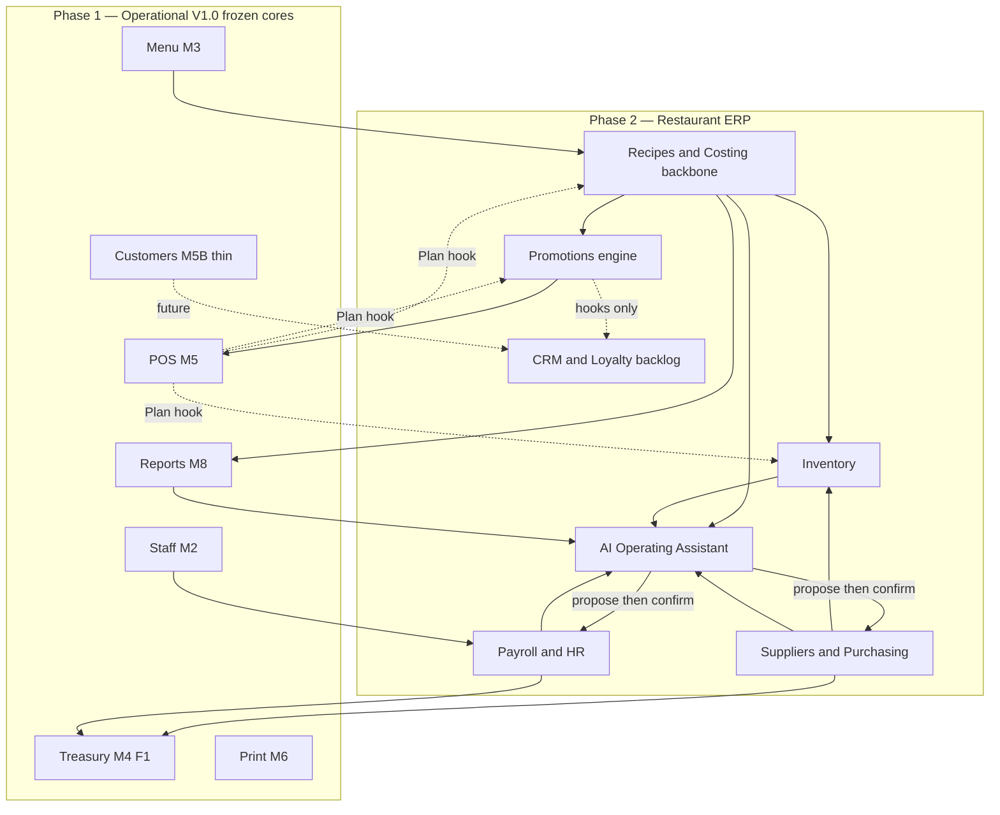

# NIHA ERP Vision 2.0

**Status:** ✅ **Approved** (2026-07-12)  
**Date:** 2026-07-12 · **Approved:** 2026-07-12  
**Phase:** Phase 2 — Restaurant ERP  
**Predecessor:** [Operational Version 1.0](./m8-final-review.md) (Phase 1 closed)  
**Scope:** single restaurant (Niha Yam) — [ADR-0017](./adr/0017-single-restaurant-scope.md)  
**ADR:** [ADR-0033](./adr/0033-niha-erp-vision-2.0.md) — ✅ **Accepted** with this Vision  
**Language of this doc:** English (repo convention); product UI remains Arabic-first / RTL

> **Vision Approved.** Phase 2 capabilities require their own Plan → Approve before Implement.  
> **Progress:** Recipes **RCA** ✅ + freeze · Inventory **INVA** ✅ + freeze · **Shift Handover OES** ✅ **Approved + Feature Freeze**.  
> **Ops amendments:** Purchasing (**V-A7…V-A13**) · Live-ops UX (**V-A14…V-A17**) · **Shift Handover** (**V-A18…V-A24**, §4.8.5).  
> Phase 2 quality bar ≥ Phase 1.

---

## Approval record

| Item | Decision |
| ---- | -------- |
| **Vision 2.0** | ✅ **Approved** (2026-07-12) |
| **Spine strategy** | ✅ **S1 — Cost & Stock Spine** |
| **Logical capability order** | ✅ Recipes → Inventory → Purchasing → Payroll → Promotions → AI (see §5) |
| **Post-Inventory reorder** | ✅ Allowed if live ops prove a different priority |
| **Recipes role** | ✅ **System backbone** — not a thin BOM screen |
| **Purchasing depth** | ✅ Full procure-to-pay for **registered suppliers** + **direct purchases** via Purchase Source (see §4.3 / V-A7…V-A13) |
| **Inventory depth** | ✅ Professional stock (movements, count, waste, expiry, UoM, recipe deduct) |
| **Promotions** | ✅ Flexible rules engine; loyalty-ready without redesign |
| **Payroll** | ✅ Full cycle; all payouts via **F1** only |
| **AI** | ✅ Operating Assistant; **no** silent financial/ops execute |
| **CRM & Customer Engagement** | ✅ Phase 2 **backlog** capability (not in current spine execution) |
| **Methodology** | ✅ Capability Vision → Plan → Review → Approve → Implement → Test → Final Review → Feature Freeze |
| **First Plan after Vision** | ✅ **Recipes & Costing** — no Implement before that Plan is Approved |
| **Phase 1 freezes** | ✅ POS · Printing · Reports remain frozen |

### Locked amendments at Approve

| ID | Amendment |
| -- | --------- |
| **V-A1** | **S1** is the approved spine; listed order is **dependency-logical**, not a rigid forever queue after Inventory. |
| **V-A2** | **Recipes & Costing** is the **backbone**: every sellable product must know components, cost, waste, yield, sell cost, margin — then Inventory, reports, AI, and Promotions depend on it. |
| **V-A3** | **Suppliers & Purchasing** is a **high bar** capability: registered-supplier cycle (PO → receive → invoice → statement → balance → dues → pay) glued to **current Treasury + F1**; supplier statement quality must match treasury ledger. **Amended by V-A7…V-A13** (not every purchase is a supplier; inventory litmus; flexible purchase permissions). |
| **V-A4** | **CRM & Customer Engagement** is an explicit **future capability** in Phase 2 backlog; Promotions and AI must be designed so loyalty/CRM can land later without redesign. |
| **V-A5** | **AI hard rules** (§4.6) are **locked** as written in the approval notes. |
| **V-A6** | Phase 2 quality bar ≥ Phase 1; no capability Implement without its own Approved Plan. |
| **V-A7** | **Not every purchase has a supplier.** Two real ops modes: (A) registered supplier purchase · (B) **direct purchase** (market / supermarket / shop) without creating a supplier. |
| **V-A8** | **Purchase Source** is first-class: every purchase has a source; source may be a **Supplier** or a **direct purchase source** — not always a Supplier entity. |
| **V-A9** | **Credit / الآجل requires a Supplier.** No deferred AP without a clear counterparty; user must pick or create a supplier for credit buys. Cash direct purchases do not create supplier balances. |
| **V-A10** | **Purchases ≠ operational expenses.** Inventory-bound goods are **Purchasing**; non-stock operating costs stay in the **existing expense** lifecycle. Cash does **not** reclassify a purchase as مصروف. **Hardened by V-A12.** |
| **V-A11** | **No Treasury redesign.** Keep current multi-treasury + F1. Future adds **Supplier Ledger**, **Supplier Payments**, **Purchase Workflow** only — all money posts through existing F1 philosophy. |
| **V-A12** | **Inventory litmus test (anti-corruption rule):** anything that **does not** enter stock ⇒ **Expense**; anything that **does** enter stock ⇒ **Purchase** (Supplier or direct Purchase Source). Cashier **expense** UI must never be the path for stock buys (flour, veg, rice, oil, …) — that path corrupts inventory cost and margins. |
| **V-A13** | **Flexible purchase permissions.** Capability-based grants (not role hardcode only): restaurant policy may allow branch manager and/or cashier to record **direct purchases** when configured; F2-ready named permissions (e.g. `purchase.direct.create`). Credit / supplier AP remains tighter (manager/owner as Plan defines). |
| **V-A14** | **Drawer holds cash until handover.** Approved cash remains in the **shift drawer** until an explicit **handover / transfer** (today: Cash Drop; target: **Shift Handover** V-A18). Main treasury does **not** auto-increase on collection approve. **Amended by V-A18…V-A24.** |
| **V-A15** | **Cashier Orders Hub = action queue.** After shift close / next day, hub should surface unpaid, partial, and action-needed orders — not clutter with fully collected closed tickets. History lives in **Shift Archive**, not the cashier work surface. |
| **V-A16** | **Shift Archive (admin).** Every closed shift is browsable with shift meta, cashier, open/close times, orders, collections, expenses, cash drops / handovers, variance, and shift summary. **No historical delete** from DB. |
| **V-A17** | **Retention policy = UI filter only.** If performance later needs a display window, it hides/archives in admin UI — it must **never** purge ledger, orders, or shift history from the database. |
| **V-A18** | **Shift Handover Workflow.** On shift close, Cash Drop is not a lone side action — close starts a **handover** with two paths: (1) **to admin/main** — Drawer → Pending Treasury Handover → admin receive → Approval → Main increases; (2) **to next shift** — Drawer → Pending Shift Handover → next cashier receive → Approval → becomes **Opening Float** of the new shift. |
| **V-A19** | **Handover approval required (F1).** Cash must not move to Main or to the next shift on request alone. Every cash transfer: **Pending → Approval → Transfer** — same F1 philosophy as expenses/collections. |
| **V-A20** | **Admin notifications for pending handovers.** Clear admin-board alerts (e.g. “cashier closed shift — awaiting admin receive”; “cashier handed trust — awaiting next shift receive”) with open → approve for entitled roles. |
| **V-A21** | **No direct Main posting for shift cash.** Users must not bump **الخزنة الرئيسية** from the treasury screen for shift-origin cash. Sole path: **Shift Handover → Approval → Treasury**. Aligns with F1; improves ops UX without a second money truth. |
| **V-A22** | **Admin receive is mandatory before Main.** Choosing “handover to admin” creates **Pending Treasury Handover only** — no immediate Main credit. Manager sees a clear receive card (cashier, amount, awaiting receive) with exactly two actions: **Receive & Approve** or **Reject / discrepancy**. Only **Receive & Approve** runs Pending → Approval → Transfer → Main. |
| **V-A23** | **Next-shift receive is mandatory before Opening Float.** Choosing “handover to next shift” does **not** auto-seed the new shift. Next cashier must confirm full trust received; then Pending → Receive → Approval → Opening Float. Reject / discrepancy blocks transfer and is logged for review. |
| **V-A24** | **No bypass while handover pending.** While a Pending Handover exists for a shift: no manual Cash Drop, no Main increase from any screen, no second handover for the same shift. **One handover per shift until closed** (approved or rejected/resolved per Plan). |

---

## 0. Executive statement

Phase 1 delivered a production-ready **operations loop**:

**Staff → Menu → Treasury → POS → Printing → Reports**

That loop is frozen where it must stay stable:

| Freeze | Rule |
| ------ | ---- |
| **POS Feature Freeze** | Bug / perf / UX only |
| **Printing Feature Freeze** | Bug / perf / UX only |
| **Reports Feature Freeze** | Bug / perf / UX only |

Phase 2 does **not** continue as “the next M-number in a chain.”  
Phase 2 expands NIHA from **POS** into a **Restaurant ERP** — one restaurant, same architectural discipline — with **Recipes & Costing as the backbone**, professional stock and procure-to-pay, labor via F1, a flexible promotions engine, and an **AI Operating Assistant**.

**Product-owner stance (locked):** Phase 2 is **more important than Phase 1** because it turns NIHA into a full restaurant ERP. Discipline must not drop.

**Success definition for Phase 2:**

> Management can see true product cost and margin from recipes, control stock and suppliers through the same financial spine as today, run payroll against approved treasury movements, apply promotions without breaking F1, grow later into CRM/loyalty without redesign, and ask an Arabic AI assistant that **reads system truth** and **never acts on money or operations without explicit human confirmation and permissions**.

---

## 1. Phase boundary

### 1.1 Phase 1 — closed (Operational V1.0)

| ID | Module | Status |
| -- | ------ | ------ |
| M0 | Foundation | ✅ |
| M1 | Authentication | ✅ |
| U1 | App Foundation | ✅ |
| M2 | Staff | ✅ |
| M3 | Menu | ✅ |
| M4 | Treasury | ✅ |
| M5 | POS | ✅ + freeze |
| M6 | Printing | ✅ + freeze |
| M8 | Reports | ✅ + freeze |
| M7 | KDS | Deferred (ops-driven; not a Phase 2 assumption) |

### 1.2 Phase 2 — approved capability set

**Spine (S1 logical order):**

1. **Recipes & Costing** — backbone  
2. **Inventory**  
3. **Suppliers & Purchasing** — full procure-to-pay  
4. **Payroll & HR**  
5. **Promotions** — rules engine (loyalty-ready)  
6. **AI Operating Assistant**

**Phase 2 backlog (not in current spine execution):**

7. **CRM & Customer Engagement** — customer record, preferences, visit history, loyalty, points, personal coupons, campaigns (design hooks only until its own Vision/Plan cycle)
8. **Live Ops UX / Shift Archive / Handover** (§4.8) — Orders Hub, Shift Archive, retention=UI-only, **Shift Handover** complete cycle (**V-A18…V-A24**) under F1 — **no** Implement from this Vision note alone

Optional / carry-over from Phase 1:

- **M7 KDS** — only if paper workflow fails in live ops  
- Draft Orders DB ([ADR-0031](./adr/0031-draft-orders-db-direction.md)) — only if ops demand  
- F2 Authorization engine — when permission matrix outgrows role capabilities  
- F1 shared approval UI — as purchasing/payroll volume grows  

### 1.3 What Phase 2 must not do

- Reopen Phase 1 freezes for “nice to have” features  
- Introduce a second financial truth  
- Multi-tenant / multi-restaurant SaaS scope  
- Fat client money math or AI that silently posts ledger / stock / PO rows  
- Inventory auto-deduct without a Recipes contract  
- Implement any capability before **its Plan is Approved**  
- Design Promotions/AI in a way that **blocks** future CRM & loyalty  

---

## 2. Architectural inheritance (non-negotiable)

| Principle | Source | Phase 2 implication |
| --------- | ------ | ------------------- |
| Thin client / thick database | [architecture.md](./architecture.md) | Cost, stock, AP, payroll math in SQL RPCs |
| Append-only ledger + approval/reversal | [ADR-0005](./adr/0005-financial-approval-and-reversal-model.md) F1 | Supplier payments, payroll payouts, purchase-related expenses use the same lifecycle |
| Official ≠ operational | [ADR-0025](./adr/0025-revenue-collection-approval.md), [ADR-0032](./adr/0032-reports-compute-from-source.md) | Cost & stock reports declare mode; AI cites mode |
| Compute from source | ADR-0032 | No rollup SSOT tables as financial/stock truth |
| Operations First | [ADR-0020](./adr/0020-operations-first.md) | Design for how the kitchen/store/manager actually work |
| Performance First | [ADR-0010](./adr/0010-performance-first-architecture.md) | Sale path stays fast; stock deduct must not block cashier UX |
| Arabic-first / RTL | [ADR-0002](./adr/0002-arabic-first-rtl.md) | AI and new admin surfaces in Arabic |
| Single restaurant | ADR-0017 | One restaurant_id |
| Docs-first + ADR | [ADR-0001](./adr/0001-record-architecture-decisions.md) | Material Phase 2 decisions get ADRs at Approve time |
| Delivery methodology | [ADR-0009](./adr/0009-delivery-methodology.md) + this Vision §7 | Per-capability Plan gates |

### 2.1 How Phase 2 touches frozen Phase 1 modules

| Touch type | Allowed? | Rule |
| ---------- | -------- | ---- |
| Read Phase 1 data | ✅ | Costing/AI may read orders, ledger, menu, print jobs |
| Narrow integration hooks (recipe deduct, promo apply) | ⚠ Only via **dedicated Plan Approve** | Explicit exception list |
| New POS/Print/Report product features unrelated to Plan | ❌ | Frozen |
| Bug / perf / UX in Phase 1 | ✅ | Under existing freezes |

---

## 3. Target system shape



**Spine idea:** *Recipes hold product cost truth; Inventory holds qty truth; Purchasing + Payroll post money only through F1/Treasury; Promotions adjust sell rules without breaking official sales; AI reads all and never acts alone; CRM extends customers later.*

---

## 4. Capability deep-dives

---

### 4.1 Recipes & Costing — **system backbone** (locked)

**Intent:** Not “a recipe screen.” Every sellable product must be understandable as **what it is made of, what it costs, and what margin it leaves** — and that truth feeds Inventory, reports, AI, and Promotions.

#### Every product must know

| Field of truth | Meaning |
| -------------- | ------- |
| Components | Ingredients / materials and quantities |
| Cost | Theoretical cost from component costs + conversions |
| Waste / الهالك | Planned waste / process loss |
| Yield | Usable output vs input |
| Sell cost | Cost attributed to the sold unit (after yield/waste policy) |
| Margin | Vs sell price (and later vs net after promos, in Plan) |

#### In scope (vision)

| Area | Includes |
| ---- | -------- |
| Ingredients / materials | Kitchen/prep SKUs; linkable to purchasable items |
| Units of measure | Base + alternate UoMs |
| Unit conversion | Explicit factors |
| Recipes / BOM | Per sellable item / prep batch as Plan defines |
| Yield & waste | First-class, not footnotes |
| Theoretical cost & margin | Server-computed |
| Price impact | When ingredient costs change, product cost/margin update |
| Menu link | Map to `menu_items` / modifiers (detail in Plan) |

#### Depends on · Enables

- Depends: **M3 Menu** (and later Purchasing for live costs)  
- Enables: **Inventory auto-deduct**, cost reports, **AI cost/margin**, **sane Promotions**

#### Open questions → resolve in Recipes Plan

| ID | Question |
| -- | -------- |
| RC-Q1 | Standard vs moving average vs last invoice cost (start mode) |
| RC-Q2 | Modifiers: mini-recipes vs deltas |
| RC-Q3 | Prep/batch recipes in first Plan slice? |
| RC-Q4 | POS freeze exception timing for deduct (with Inventory Plan) |

**First Plan after this Vision:** [recipes-costing-plan.md](./recipes-costing-plan.md)

---

### 4.2 Inventory — professional stock (locked)

**Intent:** Professional single-restaurant inventory — movements are the qty story; counts create variance; expiry is visible; sales consume via recipe.

#### In scope (vision)

| Area | Includes |
| ---- | -------- |
| Movements | Receive, issue, production, waste, adjust, transfers (if multi-location in Plan) |
| Receiving | From Purchasing GRN and controlled ad-hoc where allowed |
| Issue / صرف | Kitchen/store issue |
| Waste / الهالك | Recorded with reason |
| Stock count / الجرد | Sessions → variance |
| Variances / الفروقات | Count vs book; theoretical vs actual |
| Expiry | Lot/batch as Plan requires; FEFO guidance where used |
| UoM conversion | Same conversion discipline as Recipes |
| Auto-deduct on sale | Via recipe — event timing in Inventory Plan + POS exception |

#### Money & truth

- Qty truth ≠ treasury money truth  
- Financial write-offs via **F1** only  
- Auto-deduct requires Recipes backbone  

---

### 4.3 Suppliers & Purchasing — full procure-to-pay (locked, high bar)

**Intent:** One of the **strongest** parts of the system — not a suppliers-only master screen.  
Must match how Niha Yam actually buys: **registered suppliers** and **direct market/shop buys**, without forcing a fake supplier for every onion bag.

#### 4.3.1 Two purchase modes (ops reality — locked V-A7)

| Mode | Examples | Needs Supplier master? | Supplier statement / AP balance? |
| ---- | -------- | ---------------------- | -------------------------------- |
| **A — Registered supplier** | Flour supplier, cheese supplier, beverages | **Yes** | **Yes** (كشف حساب · رصيد · كاش أو آجل) |
| **B — Direct purchase** | Vegetables from market, rice from supermarket, oil from a shop, small tools | **No** — do not force creating a supplier | **No** |

#### 4.3.2 Purchase Source (locked V-A8)

Every purchase has a **Purchase Source**. That source is **not always a Supplier**.

Future purchase UI (when Planned) must allow:

- **Supplier** (registered), or  
- **Direct Purchase Source** (free-label / simple source for market/shop buys — exact model in Purchasing Plan)

```text
Purchase
  ├── source = Supplier     → full supplier cycle (statement, credit, balance)
  └── source = Direct       → no supplier ledger; cash may hit treasury via F1
```

#### 4.3.3 Credit / الآجل (locked V-A9)

- **Credit purchase without a Supplier is forbidden.**  
- Debt must attach to a clear counterparty: user **selects or creates** a Supplier.  
- Direct purchases are for **non-AP** buys (typically cash); they do not create supplier balances.

#### 4.3.4 Purchases vs operational expenses (locked V-A10 · V-A12)

**Hard rule — inventory litmus test:**

```text
Does this buy enter Inventory (qty / stock card)?
  ├── NO  → Expense  → existing Pending → Approval → Treasury cycle
  └── YES → Purchase → Purchasing (Supplier OR direct Purchase Source)
             even if paid cash at the market
```

| Kind | Examples | Path |
| ---- | -------- | ---- |
| **Expense** | Electricity, water, maintenance, cleaning, transport, admin | Cashier/admin **expense** screens · pending → approve → treasury |
| **Purchase** | Flour, oil, cheese, meat, vegetables, rice, stock tools/goods | **Purchase** workflow · may post Inventory receive · Supplier statement only if mode A |

**Why this matters:** Recording stock goods as expenses is the classic restaurant-system failure mode — it destroys inventory cost, recipe margins, and profit truth. NIHA must not allow that path.

**Cashier expense screen:** remains for true operating expenses only. Presence of an expense UI **does not** authorize buying inventory items through it. Purchasing Plan must provide the correct UX (and, where policy allows, a direct-purchase entry for entitled roles — V-A13).

**Cash is irrelevant to classification:** market vegetables paid cash are still a **Purchase**, because they affect stock and product cost.

#### 4.3.4b Purchase permissions (locked V-A13)

- Permissions are **capability-based** and **configurable** by restaurant policy (align with F2 direction).  
- Examples (names indicative): `purchase.direct.create`, `purchase.supplier.manage`, `purchase.approve` — exact set in Purchasing Plan.  
- Policy **may** grant **direct purchase** recording to branch manager and/or cashier.  
- **Credit / supplier AP** stays stricter (typically owner/manager) unless Plan explicitly widens it.  
- Default until Plan: do not assume cashiers can purchase; design must not hard-block future grants.

#### 4.3.5 Registered-supplier full cycle (still required for mode A)

```text
Supplier
  → Purchase Order (as Plan defines)
  → Goods Receipt (Inventory movement)
  → Supplier Invoice / obligation
  → Supplier Statement (كشف حساب)
  → Balance + Due dates (استحقاقات)
  → Payment (F1 approve → Treasury ledger)
  → Complete movement history
```

#### 4.3.6 Quality bar (locked)

- **Supplier statement** quality ≥ **current treasury ledger** (clarity, running understanding of balance, Arabic-first, export/print-class as Plan defines).  
- **Direct purchases** still need a clear audit trail (what, qty/amount, source label, who, when, which treasury if cash) — without inventing a supplier.  
- Payments (supplier or cash purchase settlement) use **existing F1 / expense-approval philosophy** — **no parallel money path**.  
- AP balance = computed from source documents + payments — not a writable balance field.

#### 4.3.7 Treasury (locked V-A11)

- **Do not redesign Treasury / multi-treasury / F1 core.**  
- Future Purchasing adds: **Supplier Ledger**, **Supplier Payments**, **Purchase Workflow** (including direct Purchase Source).  
- All balance-affecting posts continue through **current** treasury + F1 rules.

#### In scope (vision — when Purchasing Plan is opened)

| Area | Includes |
| ---- | -------- |
| Suppliers | Master, terms, contacts (mode A) |
| Purchase Source | Supplier **or** direct source (mode B) |
| POs / buys | As Plan slices define |
| GRN | Posts Inventory (qty) |
| Invoices / AP | Mode A; credit requires Supplier |
| Statement | Supplier statement (mode A only) |
| Aging / dues | Mode A |
| Payments | Via F1 → treasury |
| Separation | Purchases vs expenses via **inventory litmus test** (V-A12) |
| Permissions | Flexible direct-purchase grants (V-A13) |
| Audit | Who did what at every step |

#### Explicit non-goals here

- Opening a Purchasing Plan or Implement from this Vision note alone  
- Rewriting Treasury  
- Treating stock buys as operational expenses (forbidden by V-A12)  
- Creating dummy suppliers for market buys  
- Hardcoding “only owner can ever buy” in a way that blocks V-A13 policy later  

---

### 4.4 Payroll & HR — full cycle via F1 (locked)

#### In scope (vision)

| Area | Includes |
| ---- | -------- |
| Salary | Base structures |
| Advances / السلف | Record + recovery |
| Deductions | Fixed / variable |
| Bonuses / المكافآت | |
| Pay draws | **Daily / weekly / monthly** |
| Posting | Every wage outflow through **F1 → Treasury** |

**Locked:** No separate financial bypass for payroll.

---

### 4.5 Promotions — flexible engine, loyalty-ready (locked)

**Intent:** Not “a discount field.” A **rules engine**.

#### In scope (vision)

| Type / concern | Includes |
| -------------- | -------- |
| Combo | |
| Buy X Get Y | |
| Discounts | % / amount |
| Happy Hour | Time windows |
| Coupons | Codes; extensible to personal coupons later |
| Flexible rules | Eligibility, stacking policy, priority |
| Future loyalty | **Design hooks** so points/wallets/CRM campaigns can attach without redesign ([§4.7](#47-crm--customer-engagement--phase-2-backlog-locked)) |

#### Depends on

- Menu + controlled **POS Plan exception**  
- Recipes/Costing strongly recommended before aggressive discounting  

---

### 4.6 AI Operating Assistant — locked hard rules

**Intent:** **Operating assistant**, not chat-only entertainment.

#### Must be able to (vision)

- Analyze sales  
- Analyze profit  
- Analyze product cost (after Recipes)  
- Analyze staff performance  
- Analyze captain/driver performance  
- Suggest promotions  
- Suggest reorder / repurchase  
- Suggest suitable supplier  
- Answer in **Arabic**  
- Execute in-system commands **only after user confirmation**  

#### Hard rules (✅ locked at Vision Approve)

1. **Read by default.** Writes are proposals until the user confirms.  
2. **No financial or operational execute without explicit confirmation** (pay supplier, post payroll, approve money, create/finalize PO, stock adjust, etc.).  
3. **Full permission respect** — acts as signed-in user (or stricter); never escalates.  
4. **Cite system sources** — prefer RPCs/reports; show figures; refuse when data missing.  
5. **Arabic-first** UX.  
6. **Audit** confirmations when actions run.  
7. **Edge Function orchestration** candidate; secrets never in client; SQL remains SSOT.

#### Phased intelligence

| Stage | What | Requires |
| ----- | ---- | -------- |
| A0 | Q&A on Phase 1 data | AI Plan |
| A1 | Cost/margin | Recipes |
| A2 | Stock/reorder + draft PO proposals | Inventory + Purchasing |
| A3 | Labor & promo suggestions | Payroll / Promotions |
| A4 | Broader confirmed command library | Stable action contracts |

---

### 4.7 CRM & Customer Engagement — Phase 2 backlog (locked)

**Status:** **Backlog capability** — **not** in the current S1 execution spine. No Implement now.

**Future scope (so we do not paint ourselves into a corner):**

| Area | Includes |
| ---- | -------- |
| Customer record | Beyond today’s thin POS customer |
| Order preferences | |
| Visit history | |
| Loyalty programs | |
| Points | |
| Personal coupons | |
| Marketing campaigns | |

**Design obligation (locked now):**

- **Promotions** engine must accept customer-/coupon-scoped rules later without rewrite.  
- **AI** action catalog must allow CRM suggestions later (campaign drafts, segments) under the same confirm+ACL rules.  
- **Customers** from M5B remain the seed identity; CRM extends, does not fork a second customer SSOT without an ADR.

---

### 4.8 Live Operations UX backlog (locked principles — **not** current Implement)

**Status:** Documented from live ops (2026-07-13). **OES Plan Draft opened** — [shift-handover-oes-plan.md](./shift-handover-oes-plan.md). **No Implement** until that Plan is Approved. Does **not** break POS / Printing / Reports / Recipes / INVA freezes.

**Confirmed financial truth (do not invent a second ledger):**

- Collections approve into the **mapped treasury** (cash → **درج الكاشير**).  
- **الخزنة الرئيسية** does **not** auto-increase on collection approve (**V-A14**).  
- Target close path: **Shift Handover** with F1 approval — not silent auto-post to Main (**V-A18…V-A24**).  
- Today’s auto-approved Cash Drop remains the live mechanism until a Plan Implements handover; Vision locks the **intended** workflow only.

#### 4.8.1 Treasury UX clarity

Improve understanding **without** a second financial truth, for example:

- Show **drawer cash** clearly alongside **main treasury** balance (so “main = 0” is not misread as “restaurant has no cash”).  
- At **shift close**, drive the cashier into the **Shift Handover** choice (§4.8.5) rather than treating Cash Drop as an unrelated optional button.

#### 4.8.2 Cashier Orders Hub after shift close (**V-A15**)

Cashier work surface should be an **action queue**:

| Keep visible | Hide from cashier hub |
| ------------ | --------------------- |
| Unpaid | Fully collected + finished tickets |
| Partial | Closed noise from prior shifts |
| Needs action | |

Paid/finished history is recovered via **admin Shift Archive** / reports — not the daily cashier screen.

#### 4.8.3 Shift Archive — admin (**V-A16**)

- **Do not delete** orders or movements from the database.  
- Every shift retains a recoverable package: shift info, cashier, start/end, orders, collections, expenses, cash drops / handovers, variance, shift summary.  
- Browse any past shift at any time from admin.

#### 4.8.4 Retention policy (**V-A17**)

- Optional later **display** retention (what admin lists by default) for performance.  
- **Forbidden:** deleting historical financial or order data to “clean up.” Soft-hide / paginate / filter only.

#### 4.8.5 Shift Handover Workflow (**V-A18…V-A24**)

**Intent:** At close, cash exit from the drawer is a **handover workflow** (F1), not a silent Main bump and not an unsupervised side Cash Drop.

**End-to-end cash cycle (locked target):**

```text
Open shift
  → Sell → Collect → Approve → Shift drawer
  → Close shift → Choose handover destination
  → Pending
  → Receive
  → Approval
  → Transfer
  → Main Treasury   OR   Opening Float (next shift)
```

**On Close Shift, cashier chooses one path:**

```text
Path A — Handover to admin / Main (V-A18 · V-A22)
  Shift Drawer
    → Pending Treasury Handover   (only — Main NOT credited yet)
    → Manager receive card
         · cashier name
         · handed amount
         · “awaiting receive”
         · actions: [Receive & Approve] | [Reject / discrepancy]
    → Receive & Approve only:
         Pending → Approval → Transfer → Main Treasury

Path B — Handover to next shift (V-A18 · V-A23)
  Shift Drawer
    → Pending Shift Handover
    → Next cashier must confirm “trust received in full”
    → Pending → Receive → Approval → Opening Float
    → Reject / discrepancy: no transfer; logged for review
```

| Lock | Rule |
| ---- | ---- |
| **V-A19** | No money to Main or next shift on request alone — **Pending → Approval → Transfer** |
| **V-A20** | Pending handovers surface as **admin notifications**; entitled roles open and act |
| **V-A21** | **No direct Main posting** for shift-origin cash from the treasury screen |
| **V-A22** | **Admin receive mandatory** before Main — Pending card only until Receive & Approve |
| **V-A23** | **Next-cashier receive mandatory** before Opening Float — no auto-seed |
| **V-A24** | **No bypass** while Pending Handover exists: no manual Cash Drop, no Main bump from any screen, **one handover per shift** until closed |

Still one money truth: ledger posts only after approval (F1). Improves ops UX; does **not** redesign Treasury core (**V-A11**).

#### Explicit non-goals for this note

- No code, no Plan open, no freeze exception  
- No second ledger / no bypass of F1  
- No silent auto-transfer to Main on close  
- No Implement of handover until its Plan is Approved  

---

## 5. Sequencing (Approved S1)

### 5.1 Approved logical order

| # | Capability | Role |
| - | ---------- | ---- |
| 1 | **Recipes & Costing** | Backbone — **first Plan** |
| 2 | **Inventory** | Qty truth + recipe deduct |
| 3 | **Suppliers & Purchasing** | Full P2P + cost feed + F1 pay |
| 4 | **Payroll & HR** | Labor via F1 |
| 5 | **Promotions** | Rules engine (after cost awareness preferred) |
| 6 | **AI Operating Assistant** | Deepens as data domains land |
| — | **CRM & Customer Engagement** | Backlog only |
| — | **Live Ops UX / Shift Archive / Handover** (§4.8) | Backlog only — Plan when prioritized |

### 5.2 Reorder rule (locked)

- **Recipes → Inventory** stays the opening spine (dependency).  
- **After Inventory**, product owner may **reorder** Purchasing / Payroll / Promotions / AI based on **live operational pain**, without rewriting Phase 1 or this Vision’s principles.  
- Reorder still requires a **Plan Approve** for the chosen next capability — never jump to Implement.

### 5.3 Strategies not chosen

S2 / S3 / S4 remain documented historically as alternatives; **S1 is Approved**.

---

## 6. Cross-cutting foundations

| Track | Role |
| ----- | ---- |
| **F1** | Supplier payments, payroll, stock financial write-offs |
| **F2** | Finer grants over time (purchase.*, stock.*, promo.*, ai.act, crm.*) |
| **U1** | Arabic/RTL admin surfaces |
| **Reports** | Domain report RPCs under capability Plans; no silent M8 freeze break |
| **Edge Functions** | AI orchestration |
| **Audit** | PO, GRN, count variance, promo publish, AI confirms, future CRM |

### 6.1 POS / Reports freeze exceptions

Same as before: written in Plan, perf budget, regression suites, Final Review.

---

## 7. Methodology for Phase 2 (locked)

```text
Phase Vision 2.0 (Approved)
  → Capability Plan → Review → Approve Plan
  → Implement → Test → Final Review → Feature Freeze
```

No capability may skip Plan Approve.  
Optional per-capability mini-vision only if a Plan would otherwise be ambiguous — default is **one Plan gate** under this Phase Vision.

| Gate | Output |
| ---- | ------ |
| **Vision Approve** | ✅ Done (this document) |
| **Capability Plan Approve** | Required before any SQL/UI for that capability |
| **Final Review + Freeze** | Per capability |
| **Live ops** | May reorder post-Inventory backlog |

---

## 8. Non-goals

- Multi-restaurant / franchise OS  
- Full generic accounting suite beyond restaurant operational needs  
- Bridge/Print Center rewrite  
- Mandatory KDS  
- Autonomous AI money/stock movement  
- Implementing CRM now  
- Rewriting Phase 1 “while we’re here”  

---

## 9. Risks & mitigations

| Risk | Mitigation |
| ---- | ---------- |
| Scope inflation | Hard Plan out-of-scope; slices |
| Weak purchasing (“just suppliers UI”) | V-A3 quality bar; statement = ledger-class |
| Recipes treated as optional | V-A2 backbone; Inventory deduct blocked without it |
| POS slowdown | Perf budget on deduct/promo Plans |
| AI overreach | Locked hard rules §4.6 |
| CRM blocked by Promotions design | V-A4 + §4.7 hooks |
| Freeze erosion | Exception register in each Plan |

---

## 10. Status & next step

| Item | State |
| ---- | ----- |
| Phase 1 Operational V1.0 | ✅ Closed |
| **NIHA ERP Vision 2.0** | ✅ **Approved (2026-07-12)** |
| Spine | ✅ **S1** |
| Recipes (RCA) | ✅ Approved + **Recipes Feature Freeze** |
| Inventory (INVA) | ✅ Approved + **Inventory Feature Freeze (INVA)** |
| **INVB** | ⏸ Blocked (counts) — not assumed next if ops choose Purchasing |
| **Purchasing** | ⏸ Blocked — live-ops candidate (statement · dues · F1 pay · litmus V-A12 · perms V-A13) |
| **Shift Handover (OES)** | ✅ **Approved + Feature Freeze** — [final review](./shift-handover-final-review.md) |
| Phase 2 further Implement | ⛔ Only after explicit kickoff + Plan Approve |

**Current operating mode:** run V1.0 + RCA + INVA + Handover under freezes (bug/perf/UX only).  
**Next capability kickoff:** TBD — **INVB** or **Purchasing**.

---

## 11. Document control

| Version | Date | Notes |
| ------- | ---- | ----- |
| 0.1 | 2026-07-12 | Initial Draft |
| 1.0 | 2026-07-12 | Approved — S1, backbone Recipes, full P2P, CRM backlog, AI locks |
| 1.2 | 2026-07-12 | Ops amendments **V-A7…V-A11**: Purchase Source, direct vs supplier, credit needs supplier, purchases ≠ expenses, no Treasury redesign — Vision only |
| 1.3 | 2026-07-12 | **V-A12** inventory litmus · **V-A13** flexible direct-purchase permissions — Vision only |
| 1.4 | 2026-07-13 | **V-A14…V-A17** live-ops UX backlog: drawer vs main clarity, Orders Hub, Shift Archive, retention=UI-only — Vision only |
| 1.5 | 2026-07-13 | **V-A18…V-A21** Shift Handover Workflow skeleton (admin vs next shift), F1, notifications, no direct Main — Vision only |
| **1.6** | **2026-07-13** | **V-A22…V-A24** mandatory receive UX, next-shift confirm, no-bypass / one handover per shift — cash cycle complete under F1 — Vision only |
| **1.7** | **2026-07-13** | Opened **Shift Handover OES** Plan Draft (no Implement) · link ADR-0034 Proposed |
