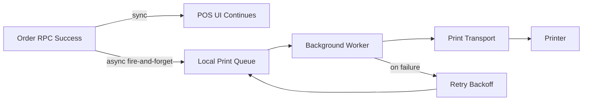
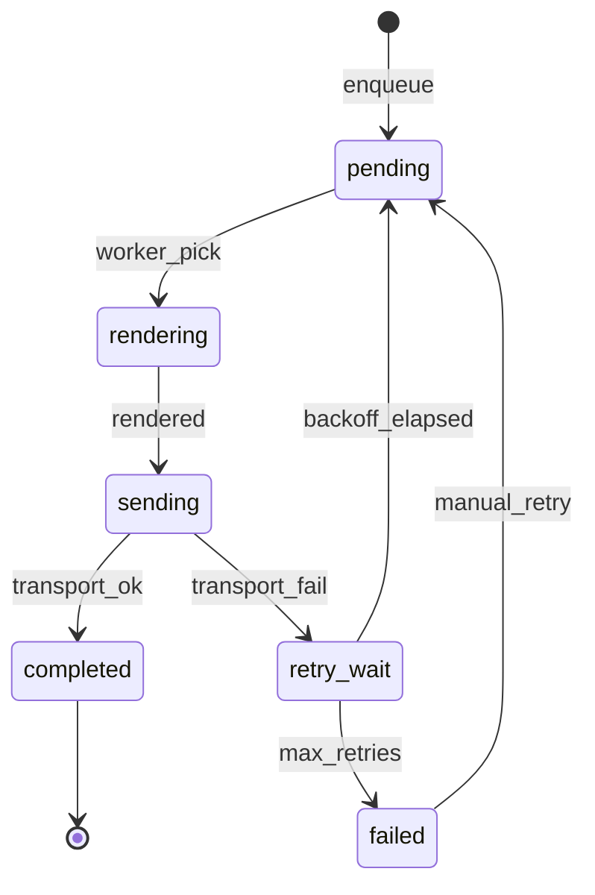

# NIHA POS — Printing Architecture

**Status:** Design baseline. **Implementation target: M6 — Printing & Order Execution**
([ADR-0029](./adr/0029-m6-printing-before-kds.md)). Documented early (U1) so the design is frozen
before feature modules build on it; M5 already enqueues `print_jobs` / kitchen tickets.
**Aligns with:** [architecture.md](./architecture.md) · [workflows.md](./workflows.md) ·
[ADR-0024](./adr/0024-order-lifecycle-three-dimensions.md).

---

## Core principle

Printing is a **side effect**, never a **precondition** for sales.

| Rule                              | Meaning                                                     |
| --------------------------------- | ----------------------------------------------------------- |
| Never await print in RPC          | `finalize_sale` / order create commit without waiting on hardware |
| Never rollback sale on print fail | Payment/order state final before queue runs                 |
| Queue is durable                  | Survives refresh / disconnect; job not lost                 |
| Non-blocking UI                   | Enqueue returns instantly; toast only on persistent failure |
| Idempotent jobs                   | `print_job_id` prevents duplicate physical prints on retry  |

**Roadmap note:** Kitchen Display (M7, deferred) consumes the same order events / jobs — it does
**not** replace this queue as SSOT for kitchen execution today (paper tickets do).

Rejected: cloud-only print that assumes the server can reach USB/LAN printers at the counter.

---

## Components

| Component          | Location                          | Responsibility                                    |
| ------------------ | --------------------------------- | ------------------------------------------------- |
| Print Orchestrator | `features/printing/orchestrator/` | Subscribe to business events; build jobs; enqueue |
| Department Router  | `features/printing/routing/`      | Map items → kitchen departments → printers        |
| Template Engine    | `features/printing/templates/`    | Render receipt/kitchen ticket to target format    |
| Print Queue        | `lib/printing/queue/` (IndexedDB) | Persistent FIFO + priority                        |
| Queue Worker       | Web Worker                        | Dequeue, send, retry — never blocks main thread   |
| Transport Adapters | `features/printing/transports/`   | Pluggable output per connection type              |
| NIHA Print Bridge  | Local install (per terminal)      | USB, raw LAN 9100, Bluetooth, Windows spooler     |
| Printer Config     | Supabase `printers`               | Branch-scoped registry                            |
| Print Audit        | Supabase `print_logs`             | Append-only attempt record (not queue SSOT)       |

**Why a local bridge:** browsers cannot open raw TCP:9100 / USB ESC/POS / Bluetooth SPP. The bridge
is a **standalone Windows tray app** ([ADR-0030](./adr/0030-niha-print-bridge.md)) — not part of the
POS web bundle — bound to the machine with a pairing token (**not** a cloud service_role key).

See [m6b-bridge-plan.md](./m6b-bridge-plan.md) for M6B Plan Gate.

---

## Job lifecycle

Retry backoff: 2s, 5s, 15s, 30s, 60s, then `failed` (manual retry). Invalid template / auth denied
do not retry. Same printer = serial; different printers = concurrent.

Job payload carries a `data_snapshot` so offline reprint/retry never re-fetches from network, plus
`template_id` + `template_version` for reprint fidelity.

---

## Connection matrix

| Connection                    | Path                         | Bridge?       | MVP (M6)       |
| ----------------------------- | ---------------------------- | ------------- | -------------- |
| LAN RAW 9100                  | Bridge → TCP → ESC/POS       | Yes           | Yes            |
| LAN Epson ePOS / Star WebPRNT | Vendor JS SDK → printer HTTP | No            | Phase 2        |
| USB                           | Bridge → USB                 | Yes           | Yes            |
| Bluetooth SPP                 | Bridge → paired device       | Yes           | Phase 2        |
| Windows Spooler               | Bridge → named printer       | Yes (Windows) | Yes            |
| Web Print (HTML)              | `window.print()` iframe      | No            | Fallback / dev |

**Queue SSOT (M6 Part A):** Postgres `print_jobs` is intent/lifecycle SSOT; the Bridge holds only a
short-lived claim buffer. See [m6-part-a-plan.md](./m6-part-a-plan.md) §3.2.

**TTL (M6B / ADR-0030 BP-12):** Jobs carry `expires_at` (default **5 minutes** from enqueue). After
expiry → `expired` — **no automatic print on reconnect**; operator uses Print Again. Prevents stale
kitchen backlog after long outages. See [m6b-bridge-plan.md](./m6b-bridge-plan.md).

**Delivery honesty (BP-13):** Completing a job means transport accepted the payload, or (when the
device supports it) printer status confirmed the job. Never imply “paper came out” without
`device_confirmed`.

**Admin (BP-14):** **Print Center** (M6C) is the **only** place for print settings and operations —
bridges, discovered Windows printers, role assignment, templates, settings, preview, Test Print,
queue (Retry / Print Again / Cancel), health, logs. **Bridge** is an execution agent only
(discover → claim → print → report). No scattered print prefs elsewhere.

**Auto-print policy (document type):** kitchen ticket on order create when items need kitchen;
customer receipt only on real collection (Pay Now `finalize_sale` or `record_collection`).
Unpaid create never prints a customer receipt. Reprint is document-type (receipt / kitchen / both)
with required reason → timeline + audit.

**M6 freeze:** No new product features mid-module; park ideas in Backlog/ADR.

Adapter interface: `connect()`, `healthCheck()`, `print(payload, format)`, `disconnect()`.

---

## Department routing (kitchen)

Tables: `kitchen_departments`, `printers`, `department_printers`, `menu_item_departments`. On
`send_to_kitchen`, group sent items by department → map to printer(s) → one job per
department/printer → enqueue async. Item without department routes to branch default; multiple
printers per department fail over by priority.

Categories ≠ kitchen stations, so a dedicated department table is used (e.g. "Beverages" category →
"Bar" department).

---

## Template system

Stored in `receipt_templates` as a versioned block-tree (`jsonb`). Block types: `text`, `line`,
`spacer`, `table`, `image`, `barcode`, `qrcode`, `cut`, `condition`. Types: `receipt_customer`,
`receipt_merchant`, `kitchen_ticket`, `shift_report`, `test_page`.

Render targets: HTML+CSS (`@page { size: 80mm auto }`) for Web Print; ESC/POS command builder for
thermal (init, code page for Arabic, bold, cut); Windows spooler receives ESC/POS bytes via bridge.

**Arabic / RTL:** template engine sets text direction per block; ESC/POS uses the printer code page
from `printers.address` jsonb. Default Arabic code page per vendor is an **open decision** to be
resolved at M8 (see modules/ADR).

---

## Persistence & audit

| Store                                                                                                  | SSOT?       | Purpose                                    |
| ------------------------------------------------------------------------------------------------------ | ----------- | ------------------------------------------ |
| `printers`, `kitchen_departments`, `department_printers`, `menu_item_departments`, `receipt_templates` | Config SSOT | Setup                                      |
| `print_logs`                                                                                           | Audit SSOT  | Append-only print history (incl. reprints) |
| IndexedDB / local claim buffer                                                                     | Runtime aid | Bridge work buffer only — **not** restaurant SSOT (see M6 Part A) |

`print_logs` / `print_attempts`: append-only attempt history (incl. reprints).
RLS: INSERT via authenticated staff/RPC/Bridge token; SELECT manager+; no client DELETE.

> **Part A plan:** [m6-part-a-plan.md](./m6-part-a-plan.md) — Pending Review before Implement.

---

## Phasing (within M6)

| Phase   | Scope                                                                                                               |
| ------- | ------------------------------------------------------------------------------------------------------------------- |
| MVP     | Web Print receipt; Bridge + ESC/POS LAN/USB/Windows; single kitchen printer; basic template; queue + retry; reprint |
| Phase 2 | Department routing; multiple kitchen printers; Bluetooth; Epson/Star SDK; Arabic RTL ESC/POS; template editor UI    |
| Phase 3 | Kitchen void tickets; label printers; cash-drawer pulse                                                             |

## Open decisions (resolve at M6 Plan gate)

- Default Arabic ESC/POS code page per printer vendor.
- Merchant-copy auto-print policy (on/off per branch).
- Bridge WebSocket API spec freeze + ESC/POS command subset doc.
